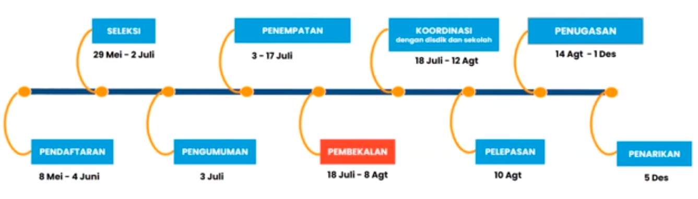
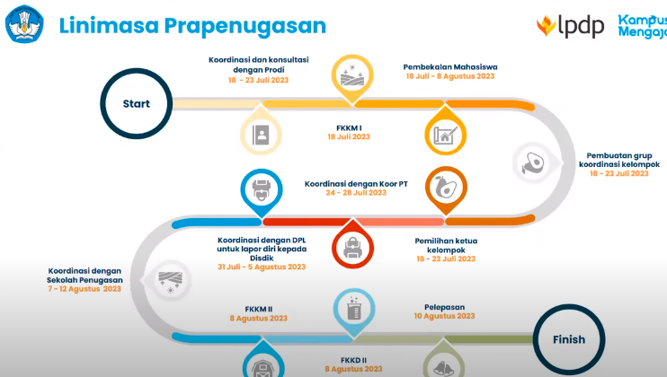
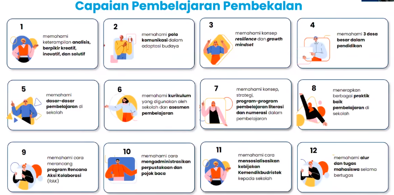

Forum Komunikasi dan Koordinasi Mahasiwa. adalah forum untuk mewadahi komunikasi dua arah apa yang dibutuhkan oleh mahasiswa. 

Fokus Program Kampus Mengajar adalah literasi dan numerasi. kampus mengajar akan melatih kemampuan menyelesaikan permasalahan yang kompleks dengan **menjadi mitra guru untuk berinovasi dalam pembelajaran, pengembangan strategi, dan model pembelajaran**

linimasa

wajib mengikuti pembekalan dan mengisi presensi apabila sesuai jadwal, jika berjalangan bisa izin ke DPL dan membuat resume.

### Koordinasi dengan sekolah penugasan
SD dan SMP: koordinasi dengan DPL untuk lapor diri ke Dinas Pendidikan Kab/Kota dan meminta surat tugas

SMK: koordinasi dengan DPL untuk lapor diri ke Dinas Pendidikan Provinsi dan meminta surat tugas.

### Tugas dan Peran Mahasiwa
1. Mitra guru, boleh mengajar tapi tidak menggantikan peran guru dengan catatan wali kelas hadir disitu
2. Kolaborasi, bukan untuk menyelesaikan masalah, tetapi berkolaborasi untuk menyelesaikan masalah
3. Adaptasi Teknologi
4. Administrasi dan manajerial sekolah
5. Sosialisasi Kebijakan Kemendikbud

### 3 dosa besar pendidikan
1. kekerasan seksual
2. intolerasni
3. perundungan

# qna
1. membutuhkan surat tugas, minta dari universitas dan surat tugas dari kementrian.
2. bisa perwakilan ketua atau semua anggota untuk melakukan pelepasan dari dinas. DPL yang akan memulai dengan dinas pendidikan kota terlebih dahulu. 

> "terbentur-terbentur terbentuk"