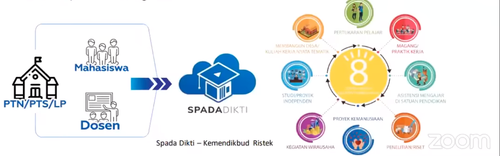

SPADA DIKTI
wahana ajar bauran nasional uang terintegrasi dengan pangkalan data dikti dan aplikasi kemendikbud lainya. 

mendukung berbagai mode pembelajaran bauran:
1. konseptual dan eksperiental
2. sinkron dan asinkron
3. daring dan luring
4. softskill dan asinkron
5. soft skill dan hardskill
6. intruksi dan interaksi

penggunaan SPADA DIKTI misalnya untuk kampus mengajar, pertukaran mahasiswa merdeka, survey kebhinekaan, seleksi dosen MBK, atau IISMA