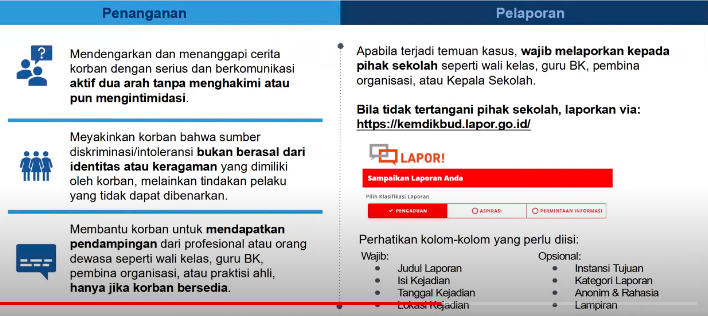

dampaka apabila tidak mampu mencintai keragaman, kerugian untuk diri sendiri:
1. kesulitan beradaptasi terhadap perubahan, sikap terbuka dan menghargai perbedaan membentuk pribadi yang mudah menyesuaikan diri terhadap perubahan sebagai bekal masa depan
2. kesulitan dalam berkolaborasi, kecenderungan untuk menutup diri dari kelompok berbeda akan menyulitkan dalam berinteraksi, berteman dan berkolaborasi dengan orang lain
3. tidak mampu bersaing di kehidupan bermasyarakat, berpengatahuan saah tidak akan cukup untuk menghadapi tantangan dunia. intolerasi akan menghambat generasi muda dalam berkarya dan mengembankan diri

kerugian yang ditimbulkan untuk lingkungan
1. merasa paling benar (ekslusivisme), mengangap kebenaran hanya dimiliki suatu kelompok tertentu memicu perasaan bahkan tindakan untuk menyingkirkan kelompok lain yang bereda
2. tumbuh prasangka dan stereotip, keengganan mengenal orang lain akan memicu prasangka dan pelabelan buruk terhadap kelompok tertentu yang belum terbukti kebenaranya
3. memicu perundungan dan kekerasan, menanamkan nilai toleransi sedini mungkin akan mencegah menjadi pelaku atau korban kekerasan

**Empati** adalah kunci unutk menumbuhkan dan menanamkan rasa cinta terhadap keragaman. 
Beberapa aspek daam menciptakan toleransi berdasarkan the british journal of society pysichology (2016)
1. kemampuan kognitif dasar
2. kemampuan kognitif sosial
3. inklusivitas
4. interaksi antar kelompok
5. interaksi antar usia
6. interaksi budaya.

setiap langkah yang dilakuakan untuk "bersama cinta keragaman" adalah mengacu pada enam profil pelajar pancasila. 

guru merancang kegiatan yang menyenangkan dan reflektif untuk mengasah 
1. rasa empati
2. kemampuan menghargai sudut pandang dan pendapat yang berbeda
3. keterampilan berpikir kritis. 

jika terjadi kekerasan, satuan pendidikan harus melakukan pengangan dan pelarporan sebagai berikut: 