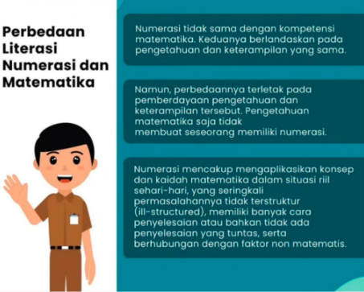

Pemateri: Itje Chodidjah
[Tugas Resume Sigit Khoirul Anam]

aspek profil pelajar pancasila
1. beriman, bertakwa kepada tugan yang maha esa dan berakhlak mulia
2. berkebinekaan
3. bergotong royong
4. kreatif
5. bernalar kritis
6. mandiri

profil pelajar pancasila merupakan bentuk penerjemahan **tujuan pendidikan nasional**

profil pelajar pancasila berperan sebagai referensi utama yang mengarahkan kebijakan pendidikan.

setiap individu murid harus mendapat kesempatan membangun 6 dimensi profil pelajar pancasila dalam proses pendidikan dan pengajaran. makna 6 dimensi pelajar pancasila
1. menerapkan pemahaman keagamaan dalam kehidupan sehari-hari
2. pelajar indonesia mengenal dan memplajari budaya lokal, regional, nasional, internasional
3. menumbuhkan kemampuan untuk melakukan kegiatan secara bersama-sama dengan sukarela, mampu berkomunikasi untuk mencapai tujuan sekitar, peduli lingkungan
4. mandiri, berarti memiliki prakarsa atas pengembangan dirinya, mengenal kekuatan dan keterbatasan dirinya serta situasi yang dihadapi. 
5. bernalar kritis memilih informasi yang akurat berdasarkan data dan fakta
6. kreatif, menghasilkan gagasan, karya dan tindakan yang orisinil. 

