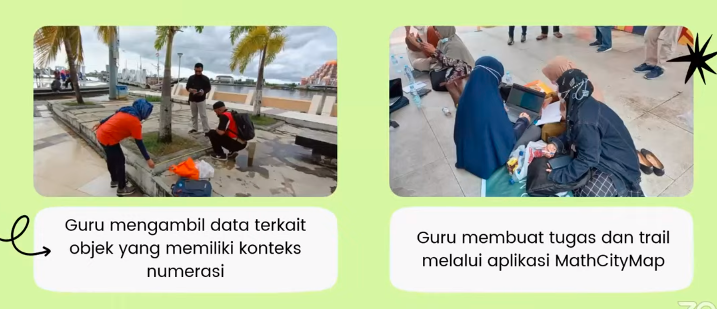
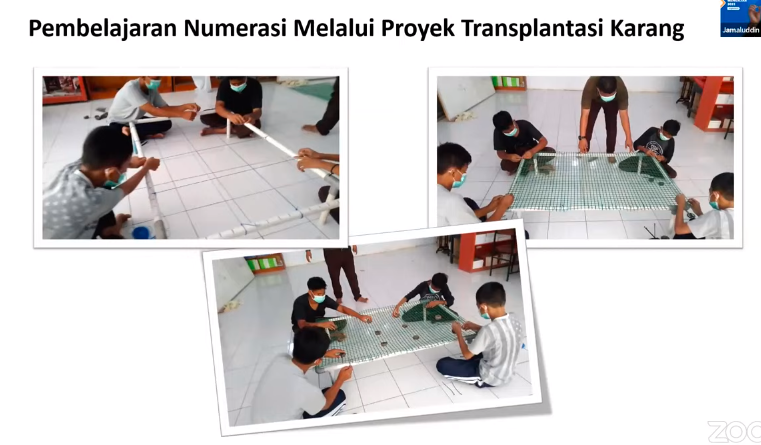

Apa itu kemampuan numerasi?
To be nunmerate is to use mathematics effectively to meet the general demands of life at home, in paid work, and for participation in community and civic life

"Berhitung adalah menggunakan matematika secara efektif untuk memenuhi tuntutan umum kehidupan di rumah, dalam pekerjaan berbayar, dan untuk berpartisipasi dalam kehidupan bermasyarakat dan bermasyarakat."

Komponen pembelajaran berdiferensiasi
1. konten, apa yang dipelajari siswa
2. proses, bagaimana siswa mengolah ide dan informasi
3. produk, bagaimana siswa menunjukkan apa yang telah dipelajari
4. lingkungan belajar, bagaimana cara siswa bekerja dan merasa dalam pembelajaran

### Tahap persiapan
1. penciptaan lingkungan belajar positif dan etis
2. menyiapkan kemampuan personal dan sosial peserta didik
3. tes diagnostik, mencakup kemampuan kognitif dan non kognitif
4. menyiapkan pembelajaran tematik dan proyek kolaboratif.

praktik baik pembelajaran bisa melalui MathCityMap.
persiapan

atau dapat melakukan wisata numerasi.