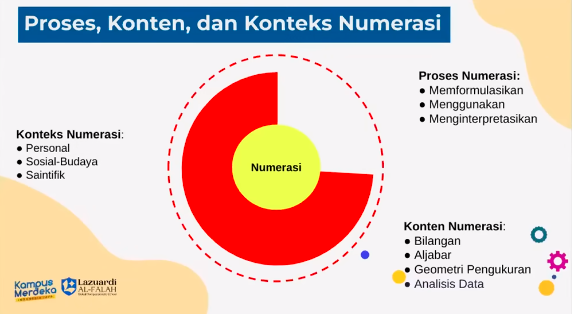
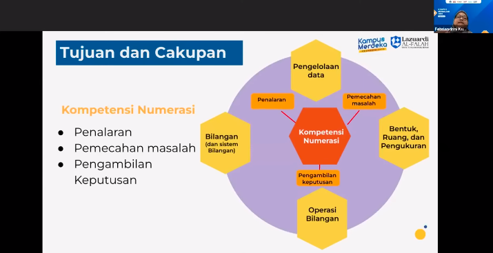
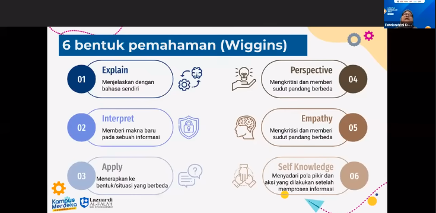

Pemateri: Febriandri
[Tugas Resume Sigit Khoirul Anam]

> setiap murid memiliki profil cara berpikir yang berbeda

menurut ahli pendidikan matematika " Matematika adalah ilmu yang membahasa pola atau keteraturan dan tingkatan", guru matematika harus memfasilitasi siswanya untuk belajar berpikir melalui keteraturan (pola) yang ada.

numerasi

## Kompetensi mumrasi
yaitu kemampuan guru untuk mendapingi peserta didik dalam **mengakses, menggunakan, menafsirkan, mengkomuniskasikan informasi** dan ide matematika untuk mengelola berbagai situasi dalam kehidupan sehari-hari. 

## Numerasi vs Matematika

Literasi numerasi: kompetensi individu mengaplikasikan konsep bilangan dan operasi hitung dalam kehidupan sehari-hari serta menginterpretasi informasi kuantitatif dengan percara diri tinggi

matematika: kapasitas individu dalam mengidentifikasi dan memahami peran matematika dalam kehidupan nyata. membuat penliaian secara mumpuni dan mengaitkan matematika untuk memenuhi kebutuhan individu tersebut sebagai warga dunia yang konstruktigf

	

Tahapan numerasi
pengalaman numerasi, pengetahuan informal, pembelajaran numerasi sekolah. ditampilkan numerasi pada DUDI dan sekolah

cakupan numerasi

#### Tujuan pembelajaran terfdifferensial

1. konten, penyajian beragam. menyajikan numerasi dengan visualisasi grafis, peraga atau demonstrasi, hingga multri-representative
2. proses, bentuk pemahaman. berbagai bentuk aksi yang menunjukkan pemahamana peserta didik terkait sebuah konsep
3. produk, hasil numerasi. proyek atau prototip, cerita fiksi, laporan, esai, argumentasi dst/.

6 bentuk pemahaman
