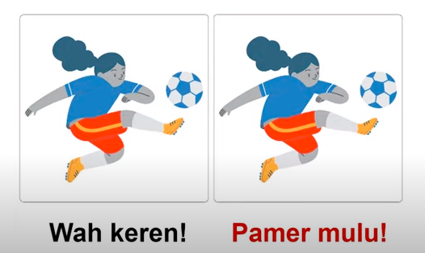

Mengelola gaya bahasa, substansi dan media pengirim. 
1. jawab segera, tetapi jangan terburu-buru
2. perhatikan tata bahasa, dan tulislah dengan lugas
3. jangan lupa attachment

show empathy
gambar yang sama bisa jadi memiliki persepsi yang berbeda-beda

6 aspek yang perlu dipahami dalam memanfaatkan teknologi
1. literasi informasi
2. etika digita
3. jejak digital
4. cara menjaga diri
5. mengelola komunikasi digital
6. cyberbullying
pesan untuk Mahasiswa Kampus Mengajar

1. pahami yang ada di lingkungan sekolah sebelum menjelaskan teori / konsep
2. berilah pesan menyenangkan dan mudah dipahami oleh peserta didik, karena memiliki kapasitas yang berbeda-beda
3. batulah peserta didik untuk mengetahui apa yang paling mereka butuhkan