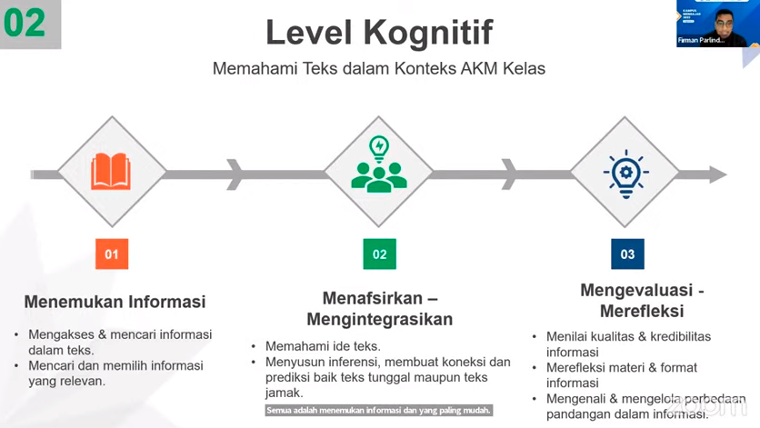
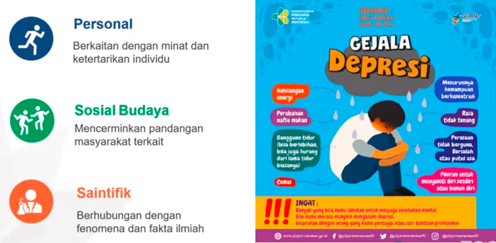
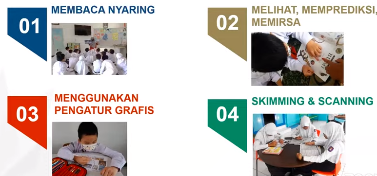
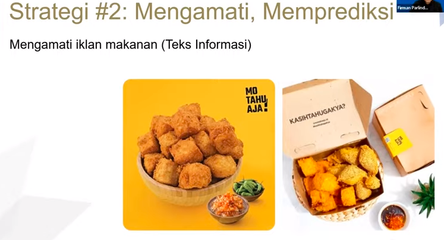
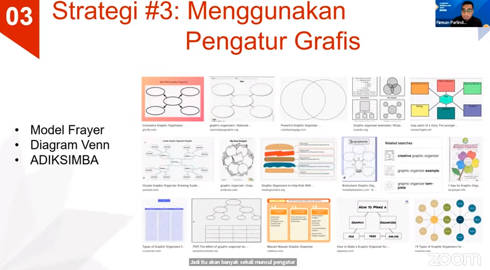
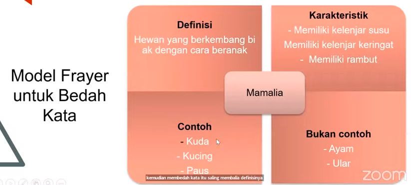
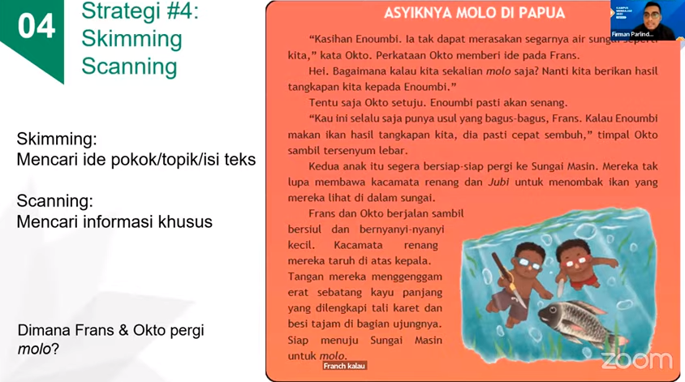

poster disampingnya adalah contoh

ragam strategi dalam pembelajaran
1. sebelum membaca
2. saat membaca
3. setelah membaca

membaca nyaring dengan mendongeng adalah berbeda. lebih mudah membaca nyaring. karena "membaca" kalau mendongeng adalah anda mengimajinasikan alur ceritanya. contohnya adala misal anda membacakan dongeng dari buku baca dongeng 

contoh pertanyaan pemantik
1. apakah bahan pangan utama makanan tersebut
2. kira-kira bagaimana bahan pangan tersebut diolah
3. menurutmu strategi apa yang dapat dilakuakan pembuat makanan untuk mempopulerkan makanan tersebut

misalnya, mengklasifikasikan kedalam diagram-diagram

