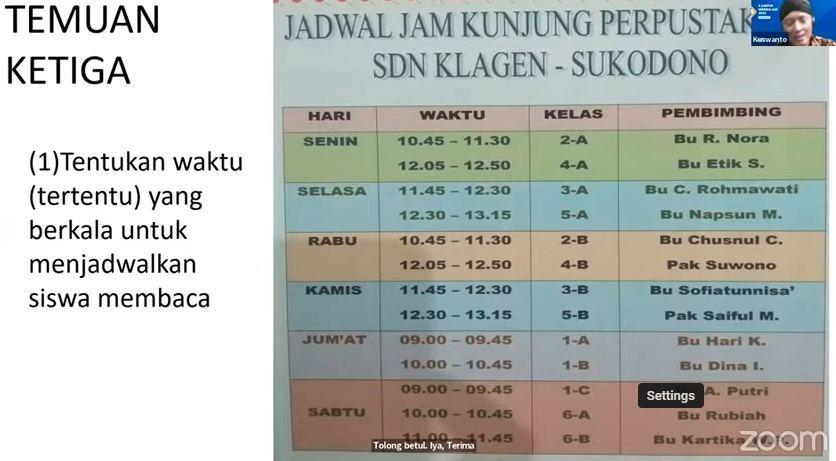
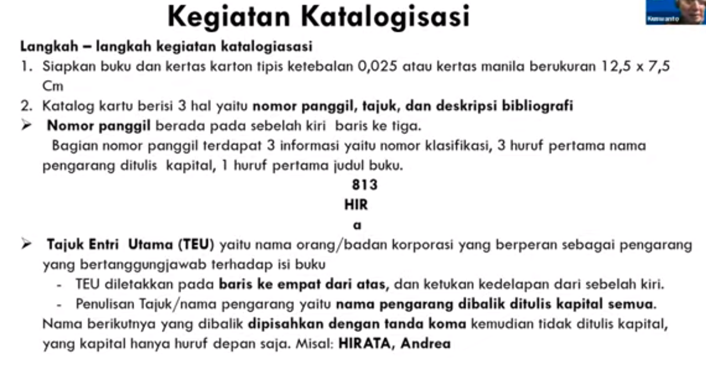
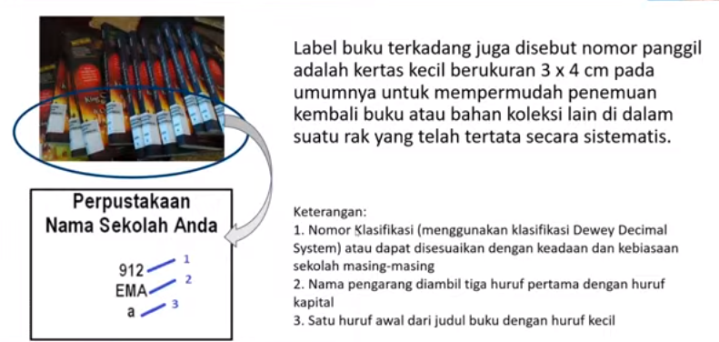
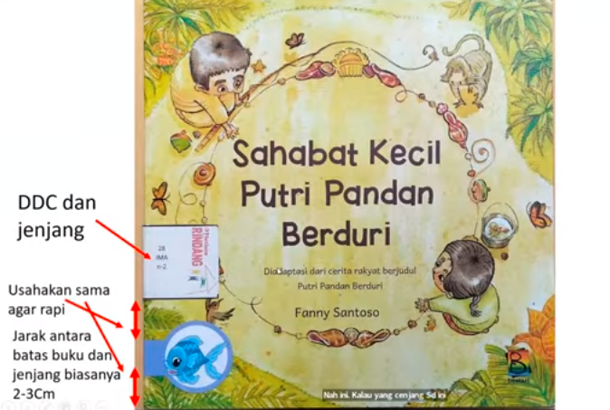
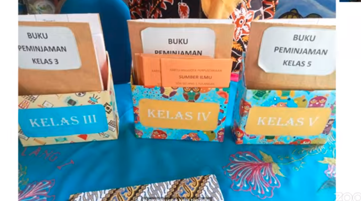
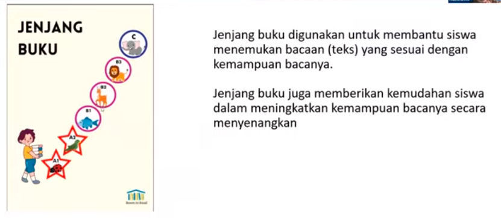

Tujuan dari course ini antara lain
1. memahami cara mengadministrasikan perpustakaan dan pojok baca (ide kreatif)
2. mampu memahami langkah-langkah penataan perpustakaan
3. memahami langkah pembuatan pojok baca
4. memahami pengelolaan perpustakaan dan pojok baca

Menyediakan perpustakaan seperti perpus keliling atau bekerja sama dengan sekolah lain untuk sama-sama membangun perpustakaan. 

memberikan alokasi untuk siswa membaca, jam istirahat idealnya adalah memang untuk istirahat.

1. pastikan buku yang layak baca
2. sebagian disimpan, dan sebagian dipajang, karena kalau perpustakaan terlalu banyak tidak enak pandang, atau kalau tempatnya kurang bisa berkreasi secara sederhana
3. jalin kerjasam dengan perpustakaan keliling atau sekolah lain untuk menyediakan perpustakaan
4. berikan alokasi sendiri untuk membaca

kegiatan nanti bukan untuk mengambil porsi guru, tetapi berkolaborasi dengan kepala sekolah atau guru untuk membuat sesuatu yang menarik

### Administrasi perpustakaan
Administrasi diartikan sebagai pengabadian terhadap subjeck tertentu.
pelayanan terhadap semua kebutuhan institusional
sebagai proses pengorganisasian sumber sumber

ISBN : penomoran dibatasi oleh puspresnas, karena memang niatnya akan dikomersialkan

 

diberikan stempel menunjukkan bahwa buku telah dikelola. 

pisahkan antar kelas. 

jenjang buku untuk setiap kelas yang sudah diatur oleh kemendikbud. setiap kode ada artinya. 

pojok baca adalah spesifik kepada kelompok tertentu sehingga terasa dekat, buku-buku dapat diambil dari perpustakaan