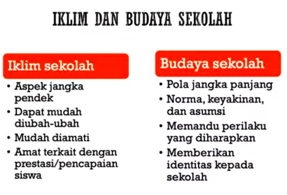
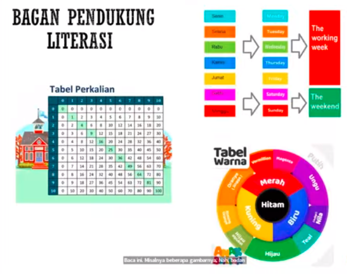
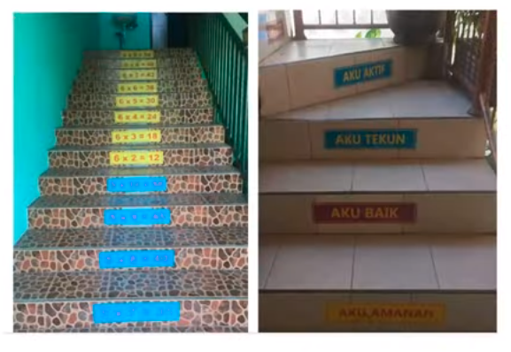
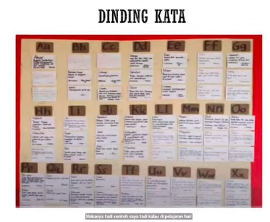
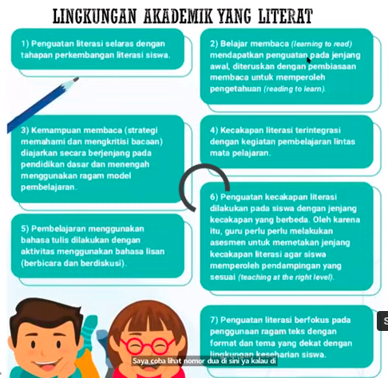
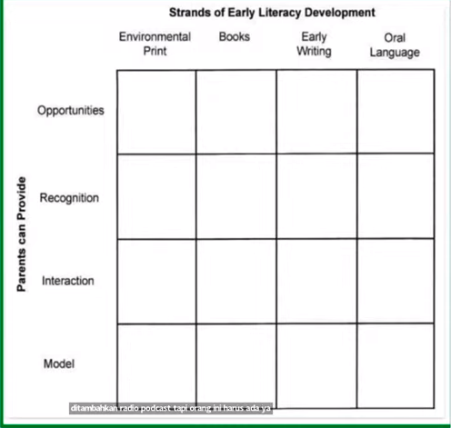
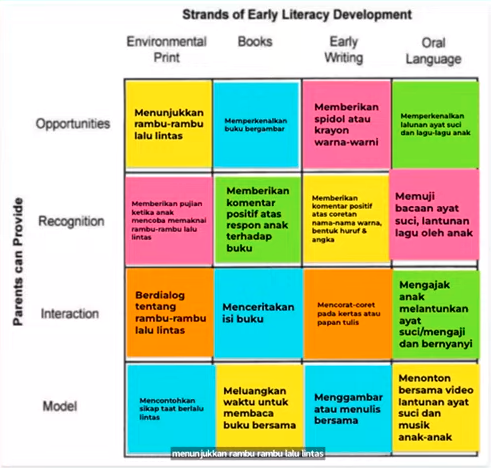
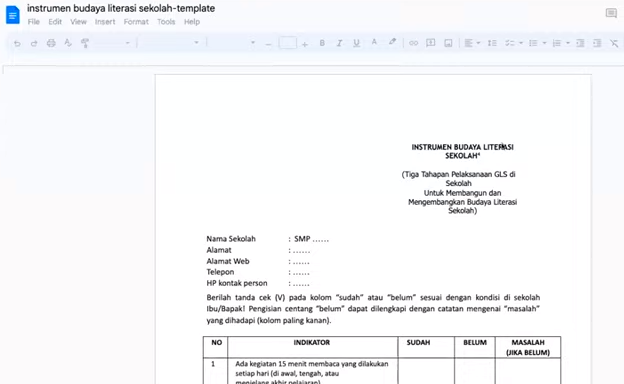

Membuat poster untuk mendorong pembaca. 

ini adalah contoh bagan yang mendukung literasi

tabel perkalian itu masuk dalam literasi. 

adalah umum ORIN Framework

yaitu
opportunities
Recognition
Interaction, dan
Model

contoh pengisian

Realisasi lingkungan akademik, pengembangan professional melalui kolaborasi dengan perguruan tinggi, perpustakaan kota, tamanb baca, dan organisasi masyarakat

survei literasi sekolah : bit.ly/instrumentbudayaliterasi

itu baik digunakan untuk mengobservasi yaitu minggu pertama. ini tidak untuk menilai sekolah, tetapi untuk mendiagnostik menyesuaikan program-program anda. 

idealnya, buku fiksi pada perpustakaan adalah lebih banyak. 