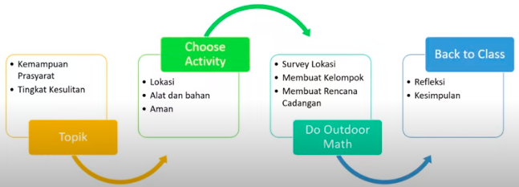
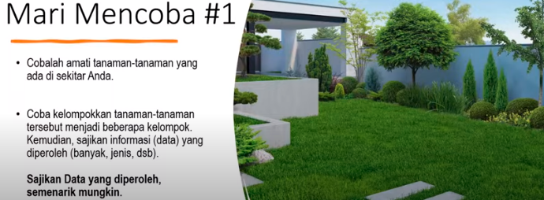

Kegiatan outdoor mathematics merupakan kegiatan yang dapat membantu anak-anak dan guru mengalami dan menghubungkan matematika dengan dunia di luar ruangan kelas

banyak macam permainan matematika yang menggunakan kartu poker. 

tahapan:

kenapa harus outdoor?
sekitar 96% siswa memiliki ingatan yang tahan laam tentang kegiatan outdoor 
adalah cara alami menghubungkan matematika ke mata pelajaran lain dan membuktikan bahwa matematika bukan hanya sesuatu yang terjadi hanya di kelas dan buku teks
memberikan kesempatan untuk berbagi dan berkomunikasi tentang matematika

contoh permainan:

