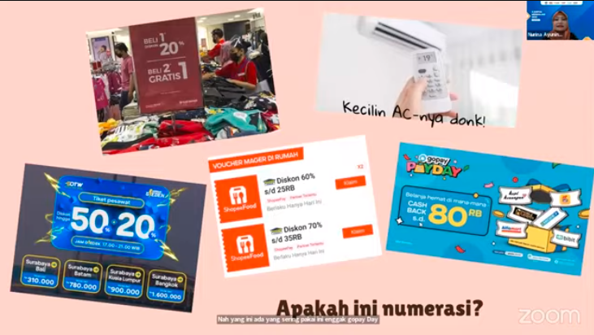
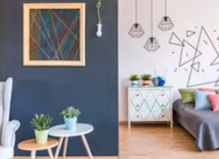
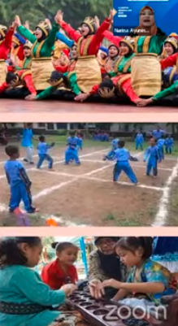
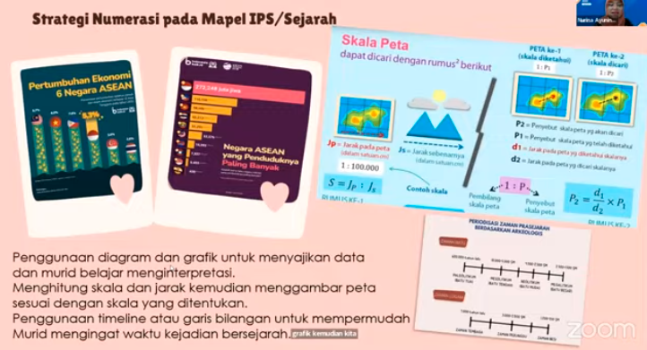
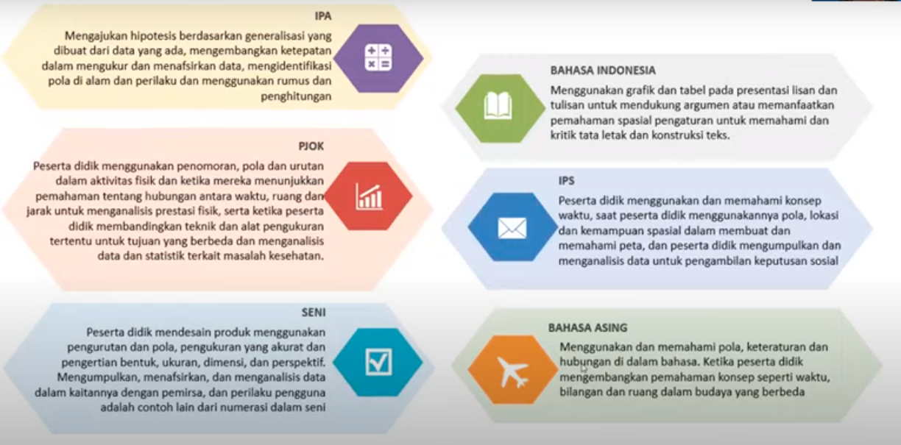
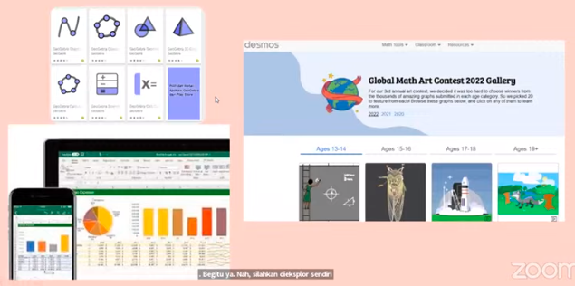

contoh numerasi dalam kehidupan
 termasuk karya estetik seperi ini
	

Numerasi adalah kemampuan berpikir menggunakan konsep, prosedur, fakta, dan alat matematika untuk menyelesaikan masalah sehari-hari pada berbagai jenis koteks yang relevan untuku individu sebagai warga negara indonesia dan dunia [kemdikbud 2017]	

> sebagian kecil masuk kedalam kategori LOTS (Lower Order Thinking Skills) sisanya masuk dalam HOTS

Numerasi selalu berhubungan dengan soal HOTS dan selalu dapat ditingkatkan dengan drilling soal AKM

gunakan numerasi dalam pembelajaran matematika dan non matematika
gunakan media pembelajaran dan alat-alat matematika sebagai penunjang pembelajaran. atau dapat menggunakan numerasi untuk permainan luar lapangan.

strategi numerasi dalam pembelajaran seni
1. pengetahuan tentang pola simetri atau asimetri
2. kemampuan mengenali dan mengambangkan pola bilangan
3. pengetahuana tengang bentuk dua dimensi dan tiga dimensi
4. kemapuang membuat dan mengintrepetasikan grid

atau numerasi dalam mata pelajaran agama seperti pertanggalan, aplikasi numersi pada mata pelajaran lainya

kegiatan numerasi di lingkungan rumah misalnya memasaka berasam orang tua, menabung dan bersedekah, memisahkan sambah, dan lainya