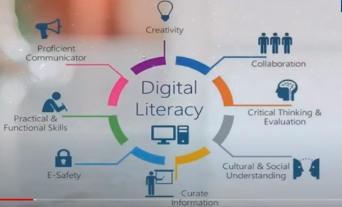
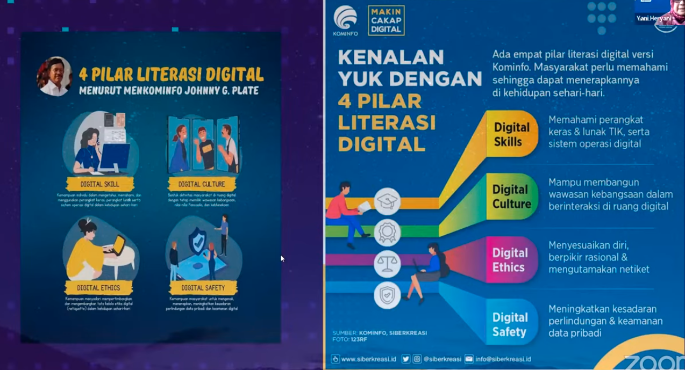
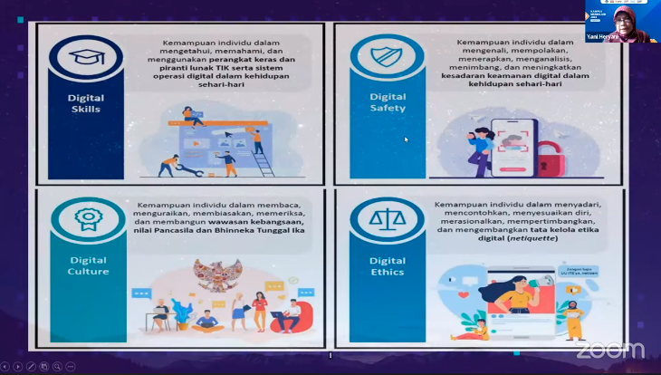

Pemateri: Yeni Heryani, M.M.Pd.
[Tugas Resume Sigit Khoirul Anam]

> Menjadi tanggung jawab bersama untuk meningkatkan literasi digital bagi anak-anak kita. agar menjadi generasi yang tangguh di masa depan dan siap menghadapi dunia yang semakin bergerak maju

Literasi digital adalah kecakapan dalam menggunakan media digital dengan etika dan tanggung jawab untuk memperoleh informasi dan berkomunikasi, beberapa manfaat yang didapat
1. berpikir kritis, kreatif, inovatif
2. memecahkan sebuah permasalahan
3. berkomunikasi dengan baik
4. berkolaborasidengan banyak orang

literasi digital lebih banyak dikaitkan dengan keterampilan teknis untuk mengakses, merangkai, memahami, dan menyebarluaskan informasi

8 elemen esensial untuk mengembangkan literasi digital
1. kultural, pemahaman ragam konteks pengguna dunia digital
2. kognitif, daya pikir dalam menilai konten
3. komunikatif, memahami kinerja jejaring dan komunikasi di dunia digital
4. kepercayaan diri, yang bertanggung jawab
5. kreatif
6. kritis
7. bertanggung jawab

pesan menkominfo

berikut adalah penjelasanya

pendekatan yang dapat dilakuakn pada literasi digital mencakup dua aspek:
1. pendekatan konseptual yang berfokus pada aspek perkembagnan kognitif dan sosial emosional
2. pendekatan operasional yang berfokus pada kemampuan teknis penggunaan media itu sendiri

kompetisi digital: keterampilan, konsep, pendekatan, dan perilaku