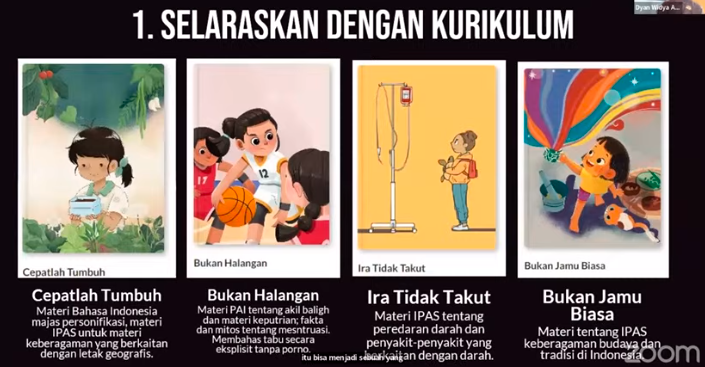
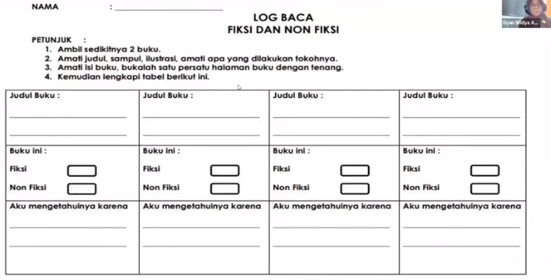
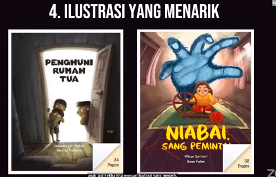

sebuah praktik baik literasi menggunakan buku cerita untuk mendukung pembelajaran di kelas.

pilihan buku
1. Selaraskan dengan kurikulum , memisahkan antara fiksi dengan non fiksi, memberikan kartu log baca, 
2. konten yang sesuai dengan usia, banyak kategori di room to read. 
3. perspektif yang berbeda-beda
4. ilustrasi yang menarik, 
5. berikan beberapa elemen yang interaktif, misalnya saat buku dibuka akan ada kertas yang terbentuk dan lain sebagainya. atau menggabung-gabungkan puzzle. 

berikan pertanyaan pemantik. 