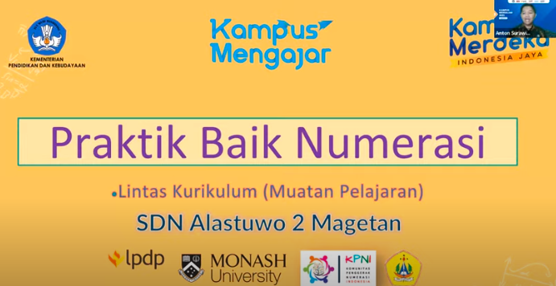

dari tari Ratoh Jaroe, secara langsung belajar mengenai
1. skill numerasi
2. mengestimasi besaran sudut dan juga macam macam sudut yang digunakan penari
3. jumlah orang yang dibutuhkan dalam tari tersebut

Linked to 21st Century Numeracy Model
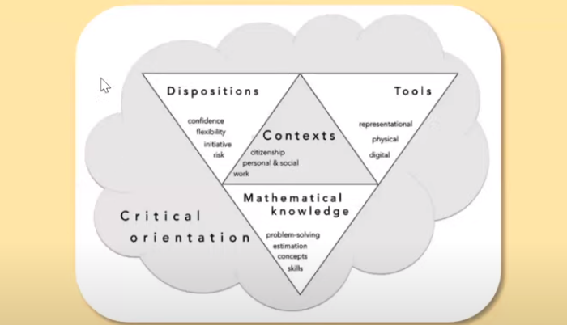
mereka dibungkus oleh critichal thingking
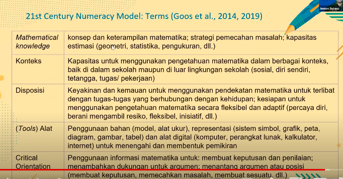

Pikirkan satu situasi seni dikehidupan sehari-hari, yang menurut anda menggunakan numerasi. tuliskan peran dan bagaimana numerasi digunakan

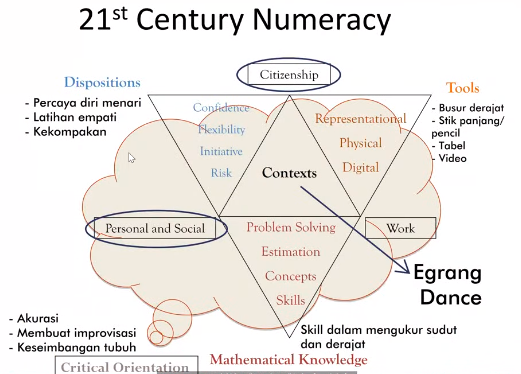
"tari egrang" mencakup beberapa komponen dalam komponen 21st century numeracy

pengorganisasian rencana pembelajaran
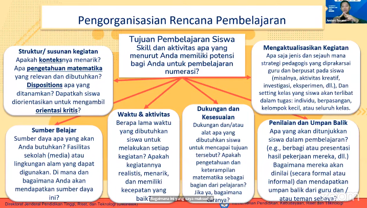, contoh 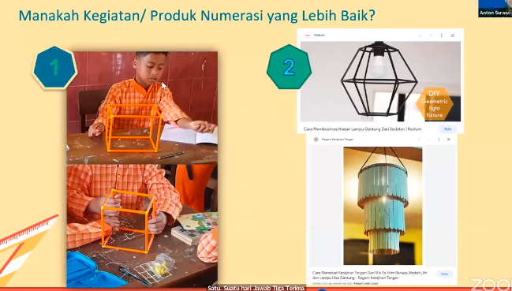

berikut adalah numerasi yang diaplikasikan pada ilmu pengetahuan sosial
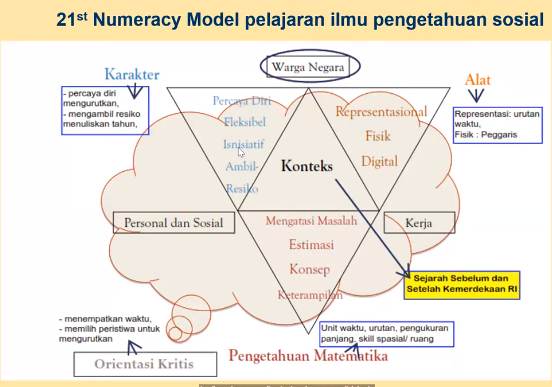

Lampion terbang
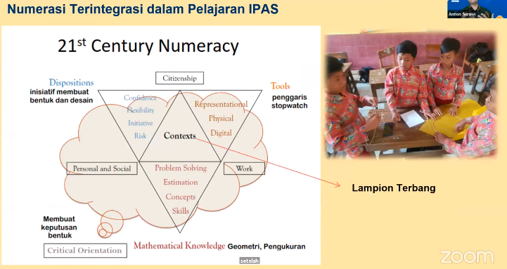
misalnya, bagaimana setelahnya lampion terbang, mau kemana dan lain-lain.
aplikasi pada PAI
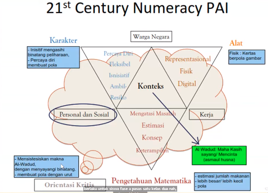
berlaku untuk Fase A (kelas 1 dan kelas 2)

STEM, adalah integrasi dari beberapa pembelahjaran. mempraktiskan kolaborasi berbagai ilmu pengetahuan, misalnya membuat jembatan
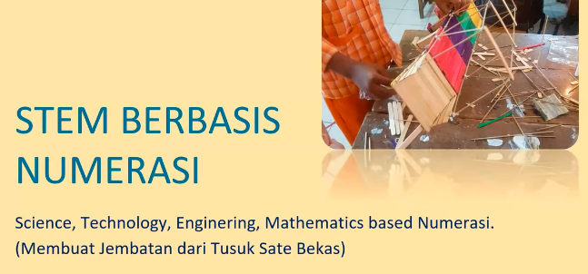
berikut framework dari kegiatan pembuatan jembatan
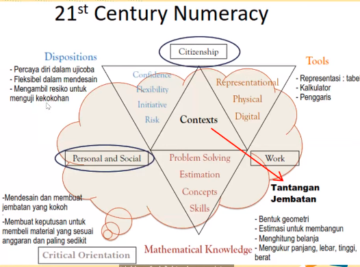
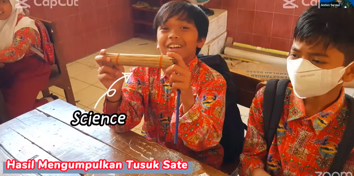
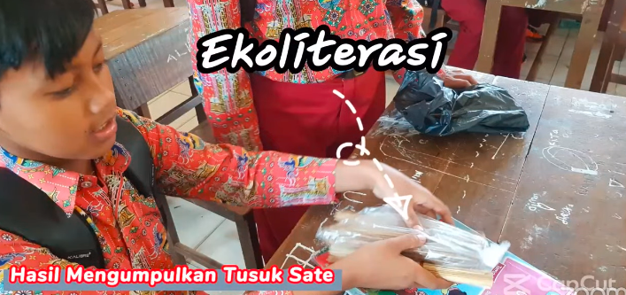
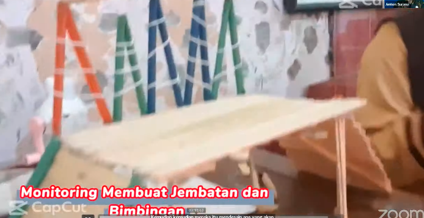
refleksi setelah kegiatan:
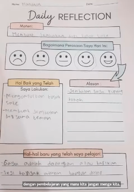
evaluasi untuk guru: 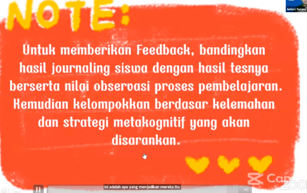
berikan feedback juga perkelompok. (apabila banyak). jika bermacam-maca, misalnya ada yang berkembang, ada yang stuck, ada yang malas dalam pelajaran, maka itu bisa dikelompokkan. 

membuat permainan seperti tic tac toe di luar kelas untuk membuat bentuk geometri misalnya
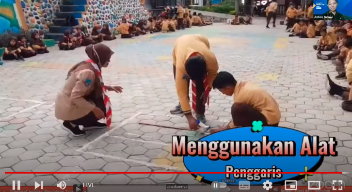

contoh untuk STEM, membuat rumah, apabila yang mengerjakan adalah anak yang berkembang, pasti rumahnya berbentuk lebih komplek lagi
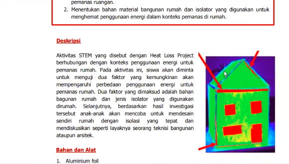 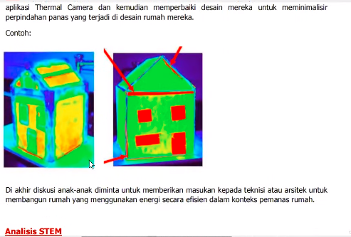
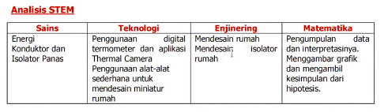

**Test asesmen diagnostik sangat penting untuk mengetahui minat siswa agar pembelajaran berjalan** misal berwawancara, atau menuliskan di selembar kertas dan menuliskan di papan jendela. 