Pemateri
Nunuk Isdanti, S.Pd. M.Pd
[Tugas Resume Pembekalan Sigit Khoirul Anam]

Numerasi:
kemampuan mengaplikaskan konsep bilangan dan keterampilan operasi hitung di dalam aktivitas dan kemampuan untuk menginterpretasi informasi kuantitatif yang terdapat di sekeliling kita.

numerasi diperlakukan untuk melakukan perencanaan, pengorganisasian, pengevaluasian sebuah kegiatan guna mendapatkan hasil yang maksimal dan mencapai tujuan yang diinginkan.

numerasi menjadi kecakapan yang diperlukan untuk menyelesaikan masalah yang dihadapi di dalam kehidupan sehari-hari.

secara umum numerasi meliputi kecakana dalam bilangan dan hitungan yang digunakan di dalam kehidupan sehari-hari meliputi:

1. bilangan
2. penambahan, pengurangna, perkalian dan pembagian
3. perkiraan
4. pola dan probabilitas
5. pecahan, desimal, prosentase, rasio dan rata-rata
6. ruang dan bangun (geometri)
7. informasi statistik
8. ukuran

strategi meningkatkan kemampuan numerasi: 
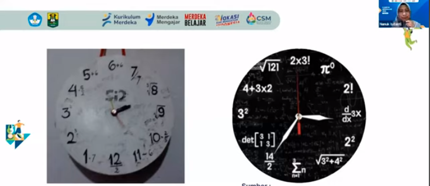

strategi numerasi lintas kurikulum ,yaitu penerapan numerasi secara konsisten dan menyeluruh di sekolah untuk mendukung pengembangan numerasi bagi setiap peserta didik

keterampilan numerasi secara eksplisit diajarkan di dalam mata pelajaran matematika, tetapi siswa didorong untuk menggunakan unsur numerasi secara kontekstual pada pelajaran non matematika. 

> menggunakan keterampilan numerasi lintas kurikulum dapat memperkaya pembelajaran bidang studi lain dan memberikan kontribusi dalam memperluas dan memperdalam serta memantu pemahaman matematika secara umum

pembelajaran numerasi dapat diciptakan melalui beberapa hal berikut

1. mengindentifikasi aspek atau unsur numerasi yang dapat dilakukan penguatan dalam mata pelajaran selain matematika
2. merancang pengalaman dan peluang belajar yang mendukung penerapan pengetahuan dan keterampilan matematika umum peserta didik dalam mata pelajaran selain matematika
3. menggunakan istilah dan terminologi matematika dengan tepat di pelajaran non matematika

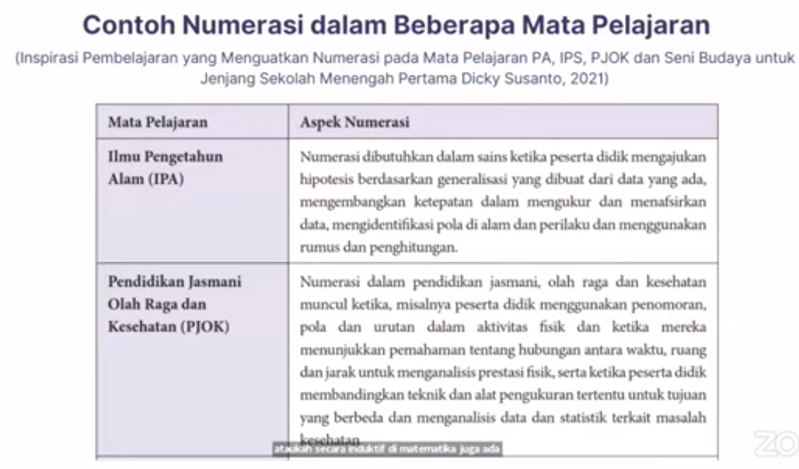

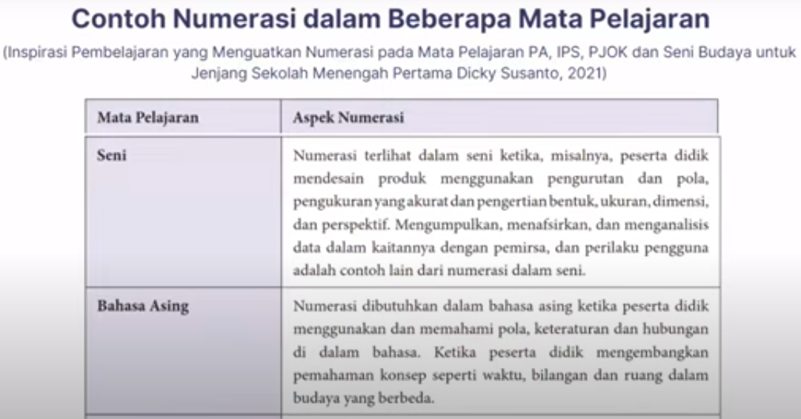

aplikasi numerasi melalui STEAM

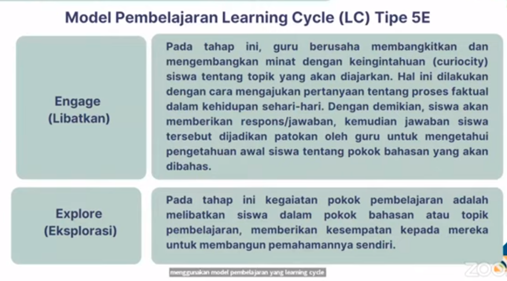 

## contoh pembuatan Humidiefer, berikut adalah contoh analisisnya 

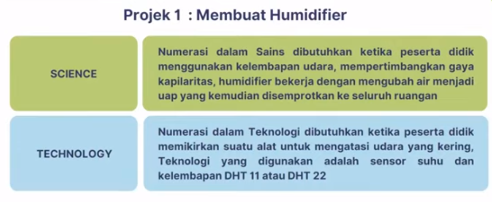

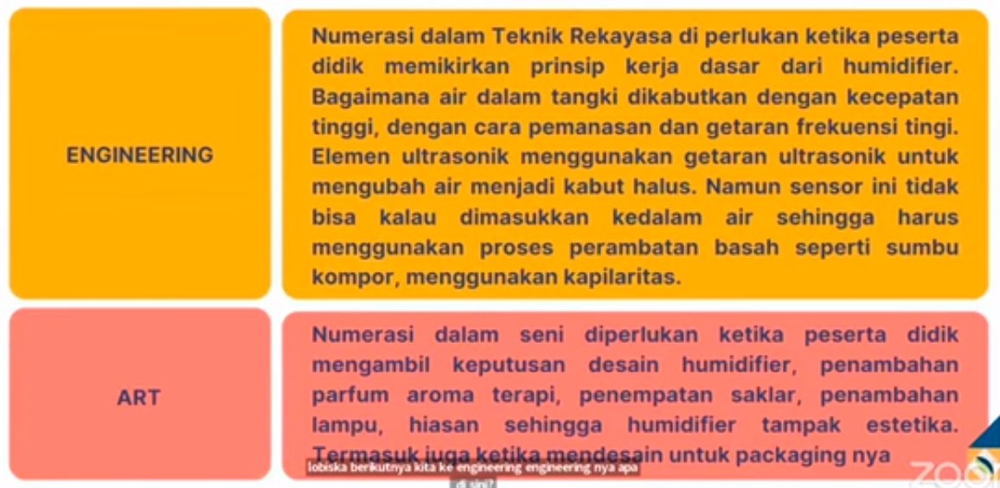
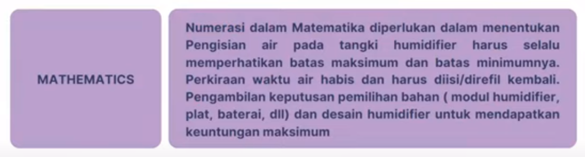

kegiatan belajar selanjutnya adala eksplorasi, seperti melihat referensi dari sumber lain

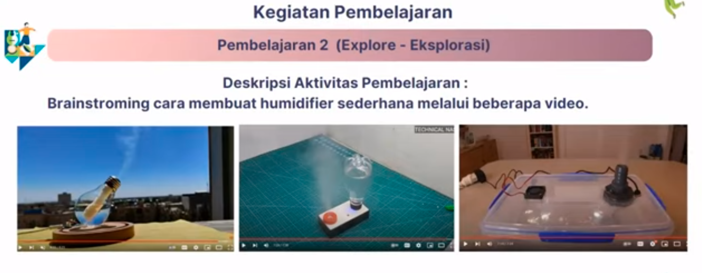

mengisi framework, yang disediakan dibawah setelah mengerjakan projek STEAM
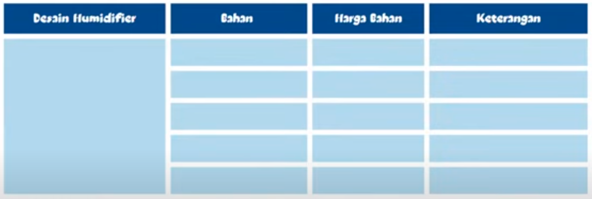

Kegiatan 3, presentasi
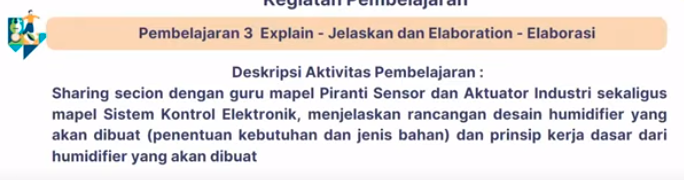

pembelajaran 4, evaluasi
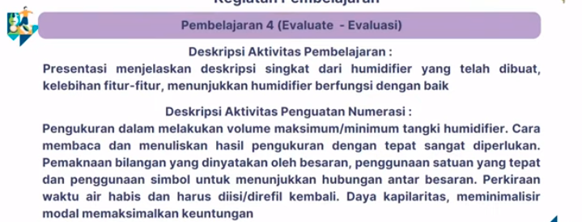