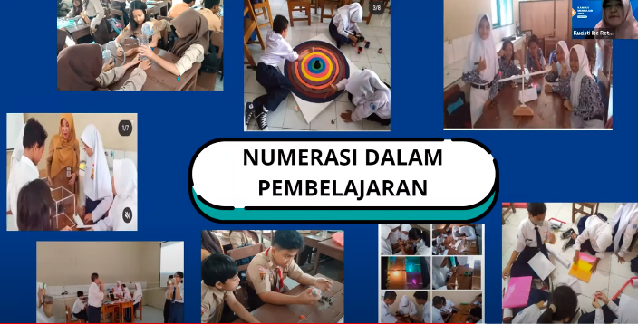
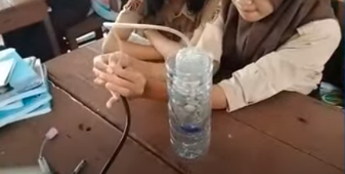
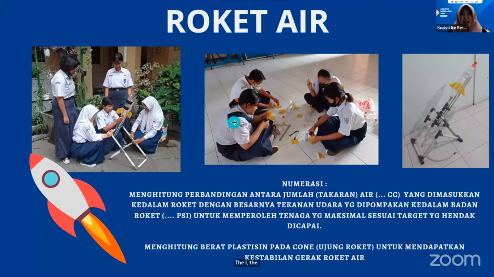
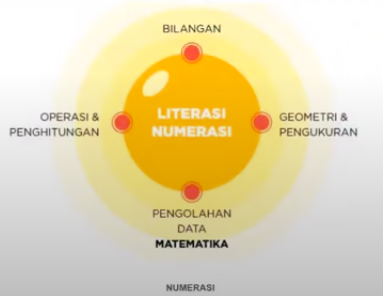
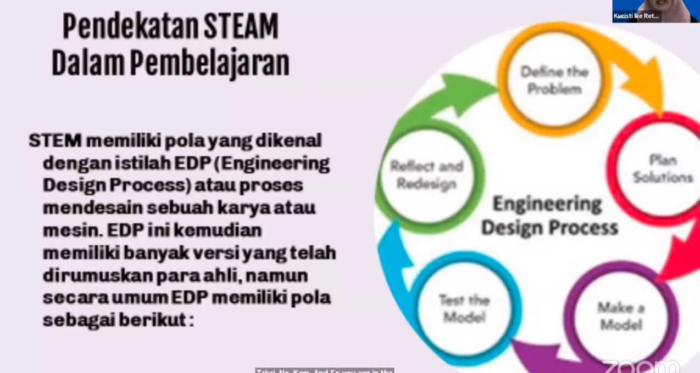
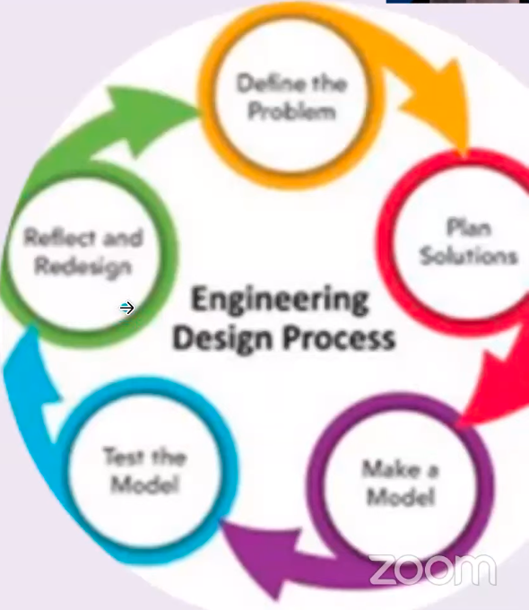
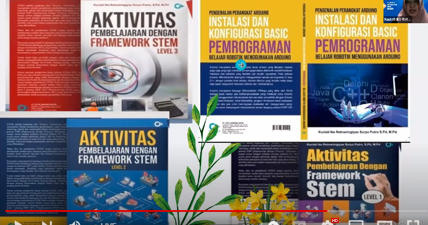
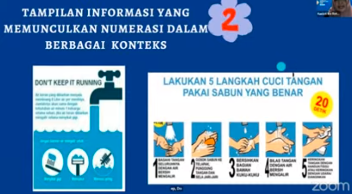
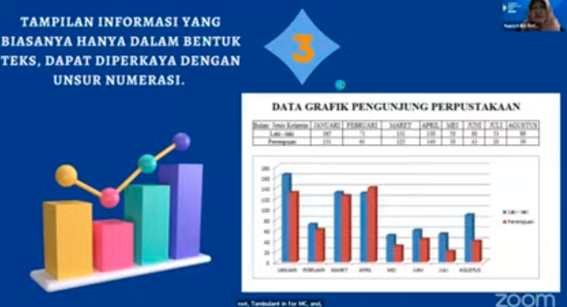

gerakan peningkatan literasi numerasi di sekolah
1. pelatihan guru matematika dan non matematika
2. peningkatan intensitas pemanfaatan dan penerapan numerasi dalam pembelajaran
3. peningkatan jumlah pembelajaran matematika berbasis permasalahan dan pembelajaran matematika berbasis proyek
4. peningkatan jumlah pembelajaran non matematika yang melibatkan unsur literasi numerasi
5. peningkatan nilai matematikan dalam PISA/TIMSS/INAP

pemanfaatan fasilitas di sekolah untuk tampilan-tampilan numerasi, misalnya, alat pengukuran tinggi badan, termometer suhu ruangan, dan nomor kelas yang menarik

diagram venn literasi numerasi:

**implementasi P5**

## FRAMEWORK STEM
STEM adalah pendekatan pendidikan yang mengintegrasikan sains, teknologi, enjiniring, art, dan matematika dengan memfokuskan proses pendidikan pada pemecahan masalah nyata dalam kehidupan sehari-hari maupun kehidipan profesi

STEM memiliki pola yang dikenal dengan istilah EDP (enggineering design process) atau proses mendesain sebuah karya atau mesin. EDP kemudian memiliki banyuak versi yang telah dirumuskan para ahli, namun berikut adalah pola umumnya: 

contoh buku untuk pembelajaran STEM:

***

>Numerasi berperan menentukan cara dan arah pembelajaran matematika di sekolah, sehingga pembelajaran matematika lebih bermakna bagi peserta didik secara kontekstual

