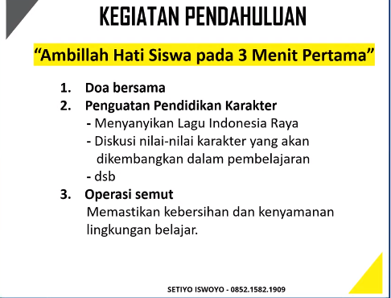

kompetensi guru: sekumpulan sikap, pengetahuan, dan keterampilan yang dimiliki, dihayati, dan dikuasi oleh guru dalam menjalankan tugas professional.
kompetensi
1. pedadogi
2. kepribadian
3. professional
4. sosial

pedadogi artinya memimpin anak, meliputi pemahaman terhadap peserta didik, perancangan dan pelaksanaan pembelajaran, evaluasi hasil belajar, pengembangan peserta didik untuk mengaktualisasikan berbagai potensi yang dimilikinya
so,, pedadogik adalah seni mengajar

perkembangan yang ditargetkan adalah fisik motorik, perkembangan emosi seperti mampu menyadari bahwa mengungkapakan emosi secara negatif tidak dapat diterima, tahap operasional konkret (berpikir konkret)

strategi yang dapat dilakukan
1. konkret
2. terpadu
3. hierarkis
4. bermain adalah belajar
5. praktik langsung
6. eksploratif dan problem solving
7. bergerak

apabila untuk anak SMP
perkembangan yang ditargetkan adalah fisik motorik, perkembangan emosi untuk peralihan dari masa kanak-kanak ke remaja (pencarian jati diri, mengalami badai emosi), tahap operasional formal (berpikir kreatif, penalaran abstrak)

strategi yang dapat dilakuakn adalah
1. konkret dan abstrak
2. terpadu
3. hierarkis (bertahap)
4. praktik langsung
5. bergerak
6. dialogis
7. pahami bakat, minat

Manajemen kelas efektif

1. namai kelas, dengan nama yang menumbuhkan motivasi/inspirasi/penguatan karakter
2. buatlah yel-yel/lagu penyemangat
3. latih pada siswa untuk menjadi warga kelas yang saling mendukung, cegah terjadinya bullying
4. pahami siswa secara individu
5. panggilah siswa dengan panggilan yang motivasi dan menguatkan emosi positif
6. bersama siswa, buatlah aturan kelas

