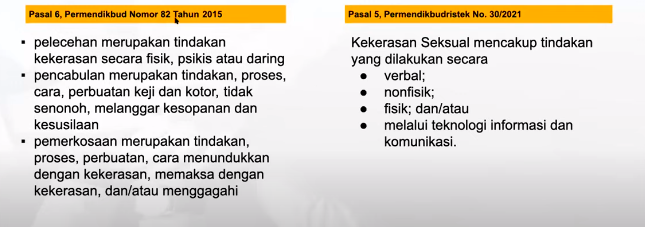

Prosedur operasional standar pencegahan dan penganan kekerasan di satuan pendidikan
1. prinsip: anti kekerasan, anti diskriminasi, kesetaraan, perlindungan anak, partisipasi, transparan, pemberdayaan, privasi,  sesuai dengan hukum yang berlaku
2. cakupan: siapa saja pihak yang terikat, dimana saja pos berlaku, selama apa pos berlaku, siapa yang berwenang
3. jenis kekerasan: kekerasan fisik, non fisik, ekonomi, seksual, perungungan, intolerasi berbasis identitas, peraturan diskriminatif
4. pencegahan: edukasi anti kekerasan, pembentukan TPPK, penepelan informasi terkait jenis kekerasan, informasi kanal internal, sistem rujukan, fasilitas inklusif
5. penanganan: alur penerimaan laporan, pemulihan korban, pemberian konsekuensi kepada pelaku, pendataan kasus, pengawasan dan evaluasi
6. rujukan: alur rujukan internal, alur rujukan eksternal, pihak eksternal yang terlibat dalam pencegahan dan penanganan kekerasan di sekolah 

bentuk kekerasan seksual, tercakup dalam pasal 6, permendikbud nomor 82 tahun 2015, dan pasal 5 permendikbudristek no. 30/2021
