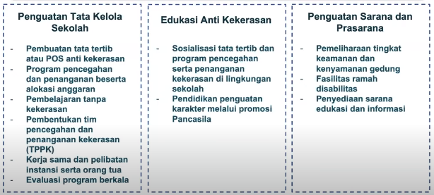

adapun visi merdeka belajar sendiri adalah mewujufkan lingkungan satuan pendidikan aman, nyaman, dan merdeka dari kekerasan, termasuk perundungan, intoleransi, dan kekerasan seksual

Karakteristik utama perundungan yang membedakanya dengan bercandaan atau jenis kekerasan lainya?
1. dilakukan secara sengaja, tidnakan agresif dilakukan secara sengaja untuk memojokkan dan menimbulkan rasa tidak berdaya sehingga korban merasa dirinya bukan siapa-siapa
2. ketidakseimbangan kekuasaan atau kekuatan, pelaku menggunakan kekuatan atau kekerasan mereka (misalnya fisik, popularitas) untuk mengontrol, merendahkan, menyakiti atau mengucilkan orang lain.
3. pengulangan aksi yang dilakuakn, aksi yang dilakukan pelaku terjadi lebih dari sekali atau memiliki kecenderungan untuk diulangi oleh orang-orang yang asam

yang perlu dilakuakan sekolah dalam pencegahan kekerasan antara lain:
