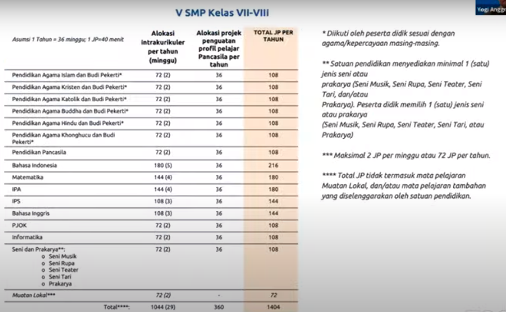

Struktur kurikulum terbagi dalam 6 fase dan 1 fase fondasi

1. fase Fondasi, paud
2. fase A, kelas 1 dan 2
3. fase B, kelas 3 dan 4
4. fase C, kelas 5 dan 6
5. fase D, kelas 7 sampai 9
6. kelas E, SMK/SMA kelas 10
7. kelas F, SMK/SMA kelas 11 dan 12

Struktur kurikulum SD/MI dibagi menjadi 3 Fasa:

1\. Fasa A, untuk kelas I dan kelas II

2\. Fasa B, untuk kelas II dan kelas IV, dan

3\. Fasa C, untuk kelas V dan kelas VI

Struktur kurikulum SMP/MTs terdiri atas satu fasa yaitu D. struktur kurikulum SMP/MTs terbagi menjadi dua yaitu pembelajaran intrakuler dan project penguatan profil pelajar pancasila (25%)

Alokasi waktu pelajaran untuk SMP (VII - VIII)

#### Pembelajaran intrakurikuler
keiatan pembelajaran intrakurikuller untuk setiap mata pelajaran mengacu pada capaian pembelajaran. pada jenjang SD/MI dapat mengorganisasikan muatan pembelajaran menggunakan pendekatan mata pelajaran atau tematik. sementara pada SMA kelas XI - XII peserta didik diberikan kesempatan memilih mata pelajaran pilihan

#### profil pelajar pancasila
Beriman, Bertakwa kepada Tuhan Yang Maha Esa (YME), dan berakhlak mulia. Dimensi beriman, bertakwa kepada Tuhan YME, dan berakhlak mulia memiliki 5 elemen kunci
Berkebinekaan Global. ...
Bergotong Royong. ...
Mandiri. ...
Bernalar Kritis. ...
Kreatif.