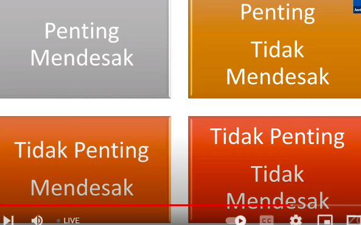

Masalah menurut adalah sesuatu yang harus diselesaikan (dipecahkan)

dalam problem solving, otak kanan dan otak lkiri harus berkolaborasi untuk menghasilakn solusi yang cemerlang

langkah langkah problem solving antara lain adalah

1. pengumulan data, jangan terburu menyiumpulkan maslaah sbelum mendapatkan informasi yang komprehensif. gali informasi ke pihak terkait. observasi. mengumpulkan fakta-fakta
2. analisis. >> masalah yang terlihat>gejala>akar masalah
3. merumuskan solusi, jika pengumpulan data analisis masalah lebih banyak melibatkan otak kiri, dalam tahapan merumuskan solusi ini kita harus lebih banyak melibatkan otak kanan. untuk mencari solusi-solusi kreatif, kita bisa melakukan proses brain strooming baik secara mandiri atau dengan melibakan pihak terkait. brain strooming dapat menggunakan metode scamper
4. membuat skala prioritas, menggunakan 4 pembagian table, seperti maudy ayunda 

