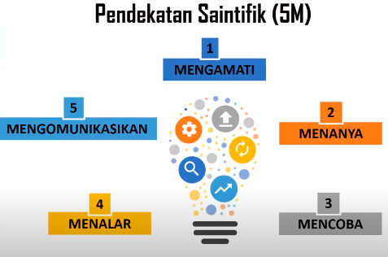

Andradogi dan pedagogi adalah saling melengkapi (berkesinambungan). pembedanya adalah sasaranya. andradogi untuk orang dewasa dan pedadogi untuk anak-anak. 

prinsip dasar yang mempengaruhi orang dewasa belajar
1. berpusat pada peserta didik
2. pengalaman sebagai sumber belajar
3. suasana emosional dan psikologis mempengaruhi kesiapan belajar
4. berorientasi pada tujuan dan problem solving
5. termotiviasi jika mempelajari sesuatu yang relevan dengan kebutuhanya
6. kemandirian belajar dnegan melibatkan dalam merumuskan tujuan pemelajaran, cara pencapaian dan mengevaluasinya. 

pendekatan saintifik 5M: 

Fungsi guru dalam hal ini hanya sebagai
fasilitator, bukan menggurui, sehingga relasi
antara guru dan peserta didik (murid, warga
belajar) lebih bersifat multicomunication.
(Knowles, 1970). Oleh karena itu andragogi
adalah suatu bentuk pembelajaran yang
mampu melahirkan sasaran pembelajaran
(lulusan) yang dapat mengarahkan dirinya
sendiri dan mampu menjadi guru bagi dirinya
sendiri. Dengan keunggulan-keunggulan itu
andragogi menjadi landasan dalam proses
pembelajaran pendidikan nonformal. Hal ini
terjadi karena dalam pendidikan nonformal,
formula pembelajarannya diarahkan pada
kondisi sasaran yang menekankan pada
peningkatan kehidupan, pemberian
keterampilan dan kemampuan untuk
memecahkan permasalahan yang dialami
terutama dalam hidup dan kehidupan sasaran
di tengah-tengah masyarakat. 