Pemateri: Hendri Pratama
[Tugas Resume Sigit Khoirul Anam]

Dalam hidup, hampir semua orang pasti pernah mengalami kegagalan, yang paling penting adalah bagaimana kita bersikap menghadapi hal tersebut. 

perilaku yang dimiliki oleh orang yang tangguh
1. optimisme
2. fleksibel
3. kemampuan mengatur emosi
4. reflektif
5. mempu meminta bantuan kepada orang yang tepat. 

tips sefruit, pikirkan hal hal yang telah berhasil anda raih, pecah masalah menjadi bagian yang lebih kecil dan atur capaian capaian yang lebih terukur. pastikan capaian disusun menggunakan metode SMART (specific, measurable, achievable, relevant, ant time-bound). 

Circle of control:
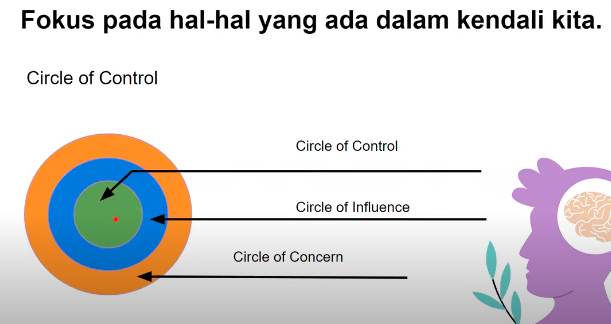

***
# Tambahan Materi Resillience 
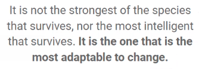
-*Charless Darwin*

yang paling sulit menurut saya adalah Dynamic Planning.

> Adaptibility is the ability to learn flexibly and efficiently and to apply knowledge across situations

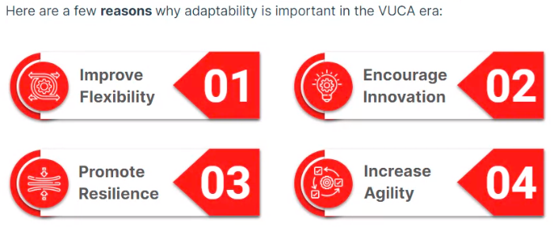

Manfaat menjadi adaptable
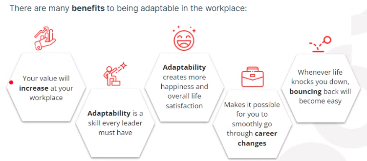

## Cognitive adaptability

misalnya berbicara ke dosen muda dan dosen tua, how you swift it.

## Emotional Adaptability

## Personality Adaptabilitu

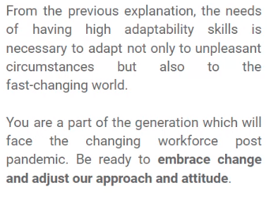

yang perlu di adaptibility
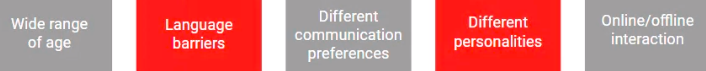

yang mungkin terjadi.
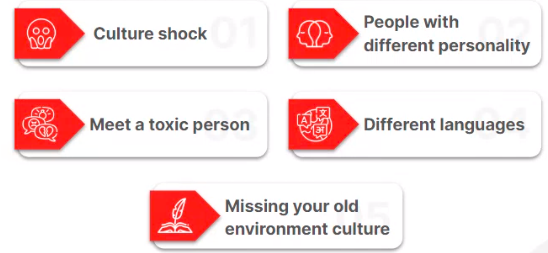

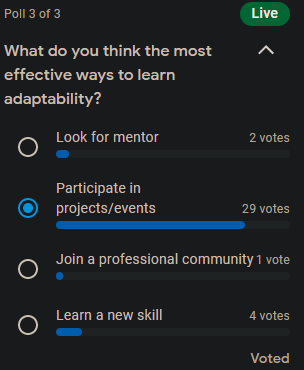

> I have not failed, i just found 10.000 ways that wont work

-*alfa thomas edison*
lets bounce after fall, no matter how fall is

## Thinking Traps

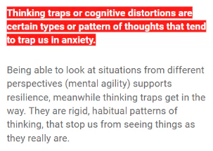

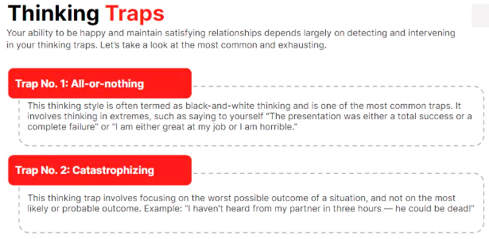

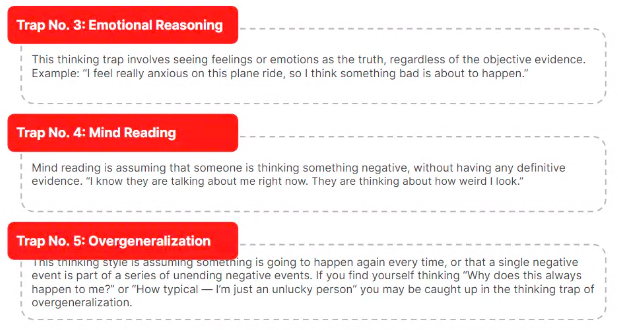

yang nomor lima, itu seperti menyamakan semua keadaan.

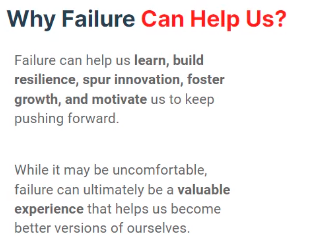

orang-orang ambis biasanya ketika gagal akan sangat down, jangan takut gagal. anda hanya akan gagal jika anda menyerah.

#### 4 Types Resilience

1.  Physical Resilence
2.  Mental Resilence
3.  Emotional Resilence
4.  Social Resilence

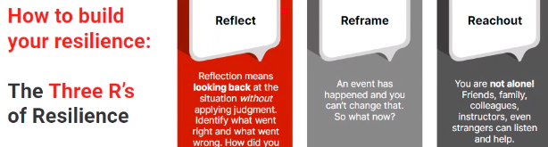

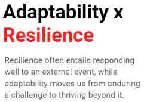

"Being resilient does not imply that people got pain, but its help you to reach what you need"

> In this Adaptability & Resilience topics we have learned about the 5 Ways we need to adapt, namely ways of interacting, achieving, learning, working, and thinking

You need two things for adaptability: recognizing something has changed. And, the ability to create alternatives.

***
# Tambahan materi growth mindset
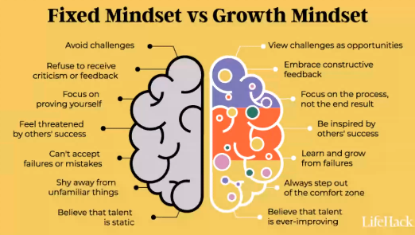

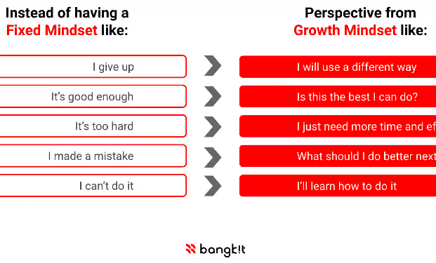

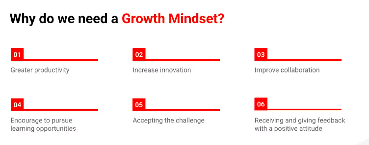

membutuhkan latihan dan aksi untuk bertumbuh. growth mindset membutuhkan tiap hari, bukan terjadi satu hari, satu minggu atau satu bulan. 

Latihan untuk membuat growth mindset habit
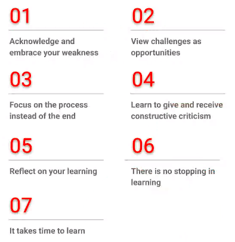
 tujuan tidak pernah berakhir, selalu ada goal yang dibuat
 
 Mindset > action > growth
 
 Tantangan + Hambatan = Growth
 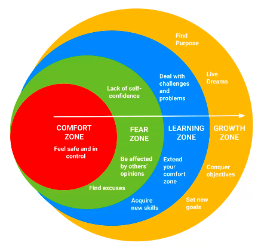
 
 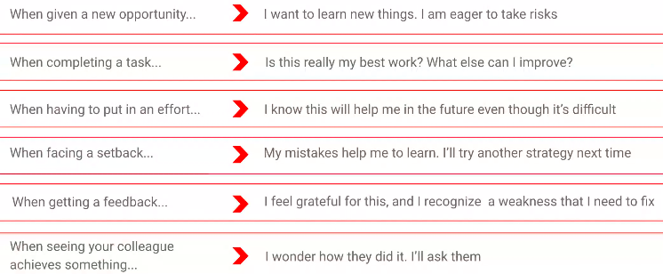
 
 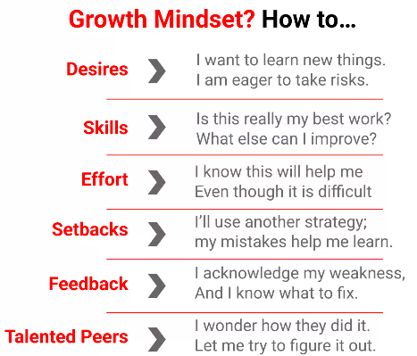
 
 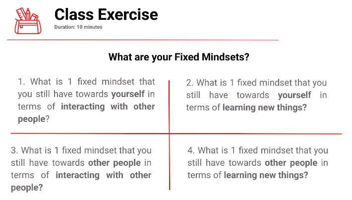
 
 what is fixed mindset that you still have towards other people in terms of interacting with other people
 
 ## Feedback
 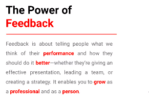
 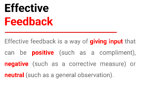
 
 pentingnya feedback
 1. inspiring growth
 2. giving people purpose
 3. improving employee engagement
 4. nurturing and solidifying working relationships
 
 Feedback yang membangun
 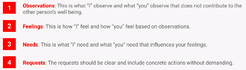
 
 Effective Feedback
 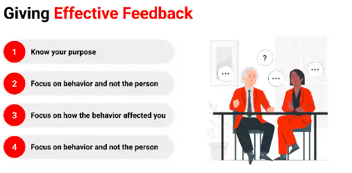
 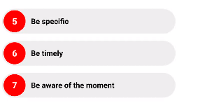
 
 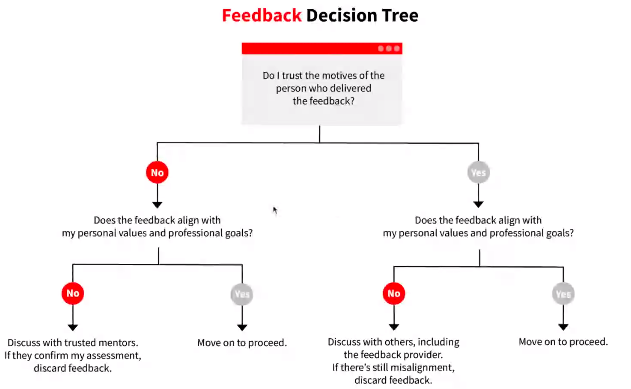
 
 ## Receive Feedback
 saat anda menerima feedback mungkin kau mengalami bentrok internal. burning out is not a goal
 
 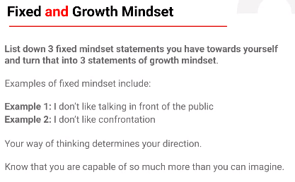
 
 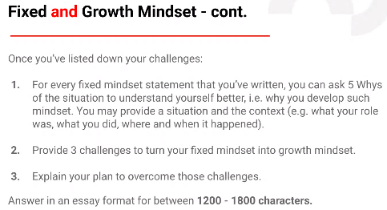
