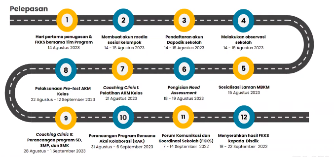
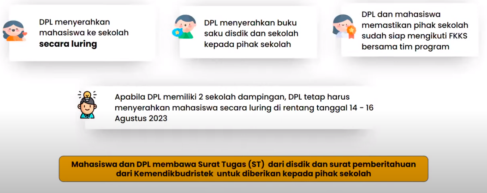
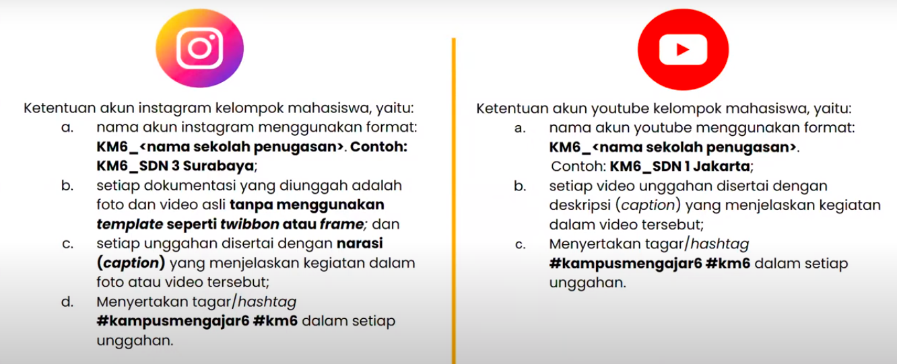
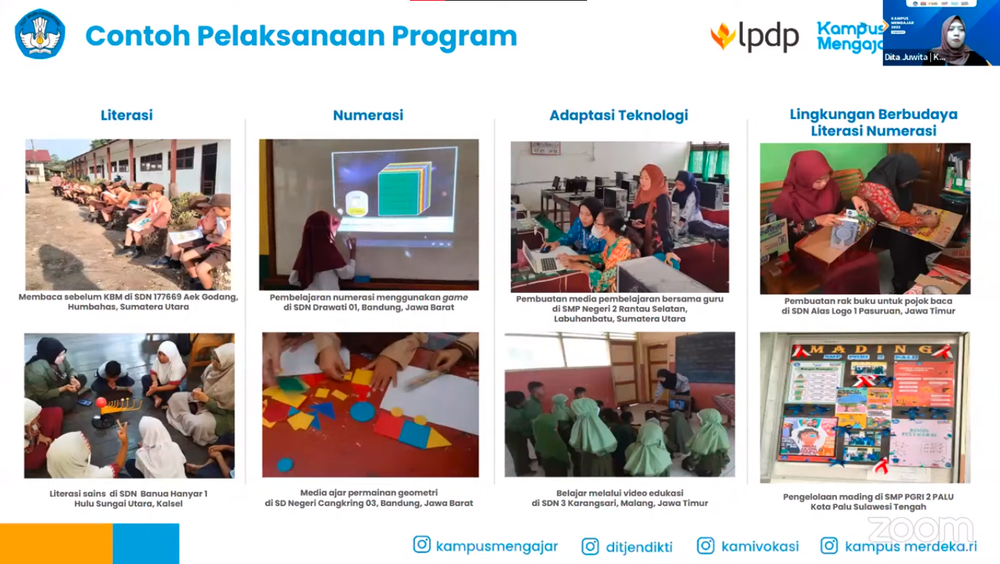
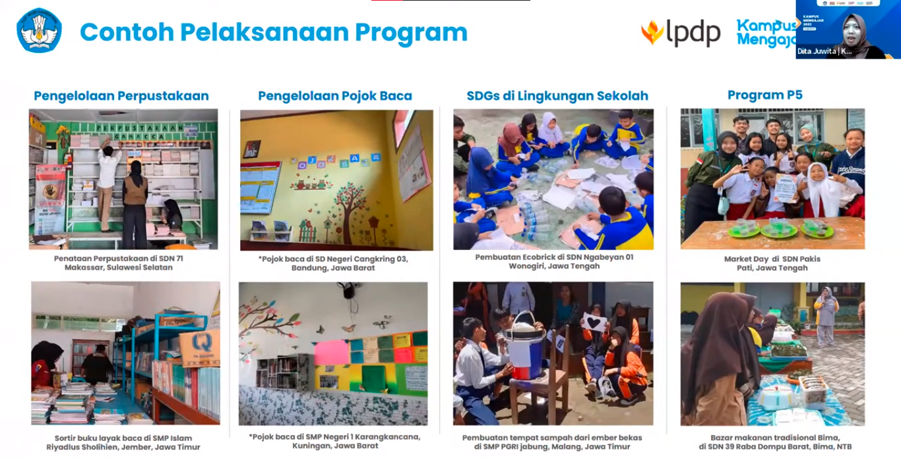
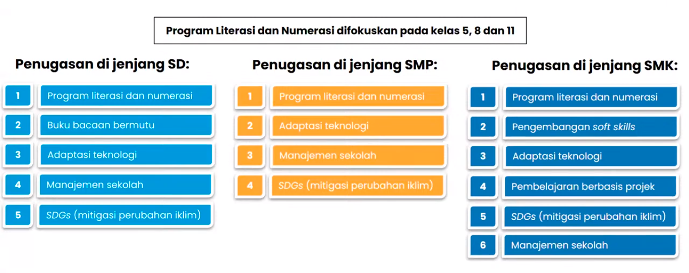
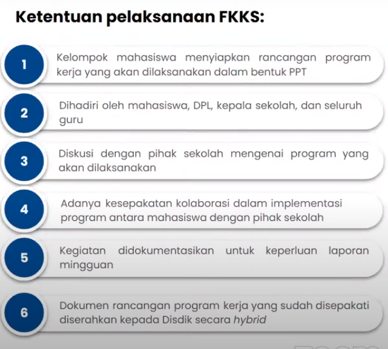

Selasa, 8 Agustus 
Waktu : 10.30 - 12.00

Forum Komunikasi  dan Koordinasi Mahasiswa (FKKM) II Kampus Mengajar Angkatan 6

#Peran dan Tugas Mahasiswa saat Penugasan
1. Mitra Guru
2. Kolaborasi
3. Adaptasi Teknologi
4. Administrasi dan Manajerial Sekolah
5. Sosialisasi Kebijakan Kemendikbud

Harus paham buku saku mahasiswa, lihat semua tahapan dan prosedur penugasan di buku saku mahasiswa

#Pelepasan Mahasiswa
Pelepasan mahasiswa secara nasional dilakukan hybrid
=> Luring di BB/BPMP Provinsi masing-masing
=> Daring melalui zoom dan live YouTube Kemendikbud RI

## 14 Agustus
Lapor Diri ke Sekolah
1. DPL menyerahkan mahasiswa ke sekolah secara luring
2. DPL menyerahkan buku saku disdik dan sekolah kepada pihak sekolah
3. DPL dan mahasiswa memastikan pihak sekolah sudah siap mengikuti FKKS bersama tim program

Note : Apabila DPL memiliki 2 sekolah dampingan, DPL tetap menyerahkan mahasiswa secara luring di rentang tanggal 14-16 Agustus 2023
- Mahasiswa dan DPL membuat Surat Tugas (ST) dari disdik dan surat pemberitahuan dari Kemendikbudristek untuk diberikan kepada pihak sekolah. 

## 14 agustus
Forum Komunikasi dan Koordinasi (FKKS) bersama Tim Program

> FKKS dilakukan diselenggarakan oleh tim kampus mengajar, dengan peserta merupakan mahasiswa, DPL, kepala sekolah, guru pamong, seluruh guru, dan pengawas sekolah. NB. intruksi dari tim KM, DPL dapat mengundang pengawas sekolah menghadiri FKKS.

Tujuan => agar seluruh stakeholder yang terlibat dalam penugasan mahasiswa Program Kampus Mengajar Angkatan 6 memahami alur penugasan mahasiswa, peran, dan tugas, serta kolaborasi mahasiswa dengan sekolah selama implementasi program.

Peserta FKKS :
1. Mahasiswa
2. DPL
3. Kepala Sekolah
4. Guru Pamong
5. Seluruh Guru
6. Pengawas Sekolah

Pelaksanaan FKKS :
Dilakukan secara daring melalui Zoom dan Live YouTube Ditjen Diktiristek

## 14 Agustus - 18
Pastikan sekolah penugasan sudah terdaftar di Dapodik. Hal ini untuk memudahkan Guru Pamong dalam mengisi nilai akhir mahasiswa
https://sdm.data.kemdikbud.go.id/

## 14 Agustus - 18
1. Observasi lingkungan kelas dan lingkungan sekolah
2. Identifikasi masalah dan kebutuhan sekolah
3. Melibatkan seluruh anggota kelompok dengan berkolaborasi bersama stakeholder di sekolah
4. Dokumentasi hasil observasi pada laporan awal/laporan minggu ke-1
5. Menyusun prioritas masalah berdasarkan hasil observasi sekolah

## 14 Agustus - 18

Akun instagram dan akun YouTube
Catatan : boleh pake tema atau twibbon/frame, asal posting juga di slide berikutnya foto asli yang tanpa twibbon/frame agar dapat digunakan sebagai administrasi dokumentasi

untuk memudahkan tracking oleh tim kampus mengajar. 

## 18 Agustus - 19
Pengisian Formulir Need Assesment,bertujuan untuk mendokumentasikan hasil observasi yang dilakukan oleh kelompok mahasiswa dalam bentuk data-data informasi sekolah. Yang mengisi cukup oleh 1 orang. 
Tautan formulir Need Assesment :
https://bit.ly/NeedAssesmentKM6

## 21 Agustus
Pelatihan teknis AKM Kelas
mempersiapkan kelompok mahasiswa dalam pelaksanaan AKM Kelas yang akan dilakukan di sekolah penugasan

Catatan : ketika pelatihan berlangsung, wajib berkumpul bersama rekan satu kelompok dan proktor/operator sekolah agar dapat melakukan praktik secara langsung.

## 22 Agustus - 12 September
Kegiatan Pre-Test AKM Kelas 

Assessment Kompetensi Minimum (AKM) Kelas digunakan sebagai alat bantu guru di kelas untuk mendiagnosa hasil belajar setiap individu murid. Tujuannya untuk merancang pembelajaran yang menyesuaikan tingkat kompetensi murid (*teaching at the right level*). bisa meminta bantuan guru untuk memilih kelas apa (A, B, C) untuk dilakukan AKM pada kelas 8 SMP

1. Wajib dilaksanakan oleh seluruh kelompok mahasiswa
2. Dilaksanakan oleh peserta didik kelas 5 untuk SD, kelas 8 untuk SMP, dan kelas 11 untuk SMK. 
3. Maksimal diikuti oleh 30 siswa (tidak boleh lebih) 
4. Dilaksanakan melalui PC/laptop (Windows) atau gawai (android) 
5. Dilaksanakan dengan koneksi internet (online) atau tidak menggunakan koneksi internet (offline)
	

Perancangan Program Kerja
1. Analisis masalah **berdasarkan** hasil observasi dan AKM kelas siswa
2. Pemetaan masalah yang ditemukan di sekolah
3. Membuat skala prioritas solusi berdasarkan pemetaan sekolah, **dirasa anda sanggup dan kompeten**
4. Merancang program yang sesuai dengan kebutuhan siswa di sekolah

>perancangan program kerja akan dibahas lebih lanjut pada Coaching Clinic II

Prinsip-Prinsip Program
1. Kontekstual
2. Diferensiasi
3. Kolaborasi
4. Keberlanjutan

## 7 September - 14
FKKS, untuk menyepakati program kerja yang akan dilaksanakan oleh mahasiswa di sekolah. dihadiri oleh mahasiswa, pihak sekolah, dan DPL

Dokumen rancangan program diserahkan ke disdik kota sleman.
***

Alur Saat Penugasan
1. Implementasi Program di Sekolah (15 September - 1 Desember 2023) 
2. Sharing Session Inspiratif (29 September 2023) 
3. Pengisian mid-assesment (2-13 Oktober 2023)

Catatan besar :
1. Mahasiswa wajib datang ke sekolah setiap hari sesuai dengan jadwal kegiatan belajar di sekolah.

2. Mahasiswa harus mengajar, kan ini Program Kampus Mengajar. Temen-temen bisa implementasikan penguatan literasi & numerasi pada saat mengajar. Nah temen-temen mahasiswa harus bisa membagi antara waktu mengajar dan menjalankan program kerja.

3. Bagi mahasiswa KM yang masih mengikuti jadwal kuliah harus dikomunikasikan, dengan anggota kelompok, dengan DPL, dengan guru pamong, dan kepala sekolah. Intinya jangan ngilang, harus dikomunikasikan dan dijelaskan untuk kasih pengertian ke semua pihak yang terlibat dalam penugasan Kampus Mengajar di sekolah penugasan

4. Jika ada DPL yang tidak kooperatif/tidak bisa dihubungi. Laporkan ke helpdesk, intinya laporkan ke Tim Program

5. Jika ada sekolah yang tidak mendukung penuh kegiatan KM. Lagi-lagi temen-temen harus komunikasi, komunikasikan ke pihak Sekolah, kalo bisa komunikasikan dan libatkan DPL ke pihak Sekolah

6. Laporan Mingguan harus diunggah sesuai waktu yang ada di laman MBKM, kalo telat ini berpengaruh ke cairnya BBH

Akhir Penugasan
1. Post test AKM Kelas (6-29 November) 
2. Pengisian End-point Survey (6-26 November) 
3. Pengisian End-assessment (13-26 November) 
4. Coaching Clinic III / Teknis Penyusunan Laporan Akhir (17 November)

Laporan dan Penilaian
1. Mingguan
2. Kegiatan Penilaian
3. Akhir