# A. Menggunakan Dekstop
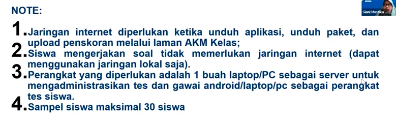
dapat menggunakan jaringan lokal. apabila kurang dari 30, maka semua siswa perlu melakukan pretes (berlaku jika siswa lebih dari 30).

domain platform untuk mengunduh pake tes dan upload scoring adalah dibawah ini. 
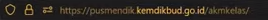

terdapat video tutorial dan FAQ dalam platform tersebut. 

untuk login ke platform tersebut gunakan nama pengguna adalah email yang terdaftar di MBKM dengan kata sandi adalah NPSN sekolah.

pilih dashboard 
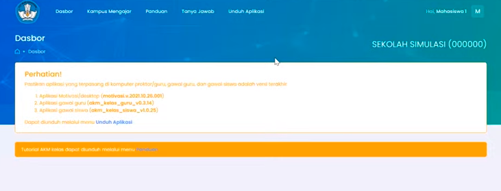
kemudian pilih pada bagian kampus mengajar, aplikasi berbasis desktop dan ada juga yang android. pilih salah satu apakah akan menggunakan desktop atau android. sesuaikan dengan kebutuhan dan kesiapan di sekolah masing-masing. berikut tombol untuk unduh aplikasi

silahkan dipilih link nya (aktif) yang belum mencapai limit

akan diarahkan pada google drive: versi desktop
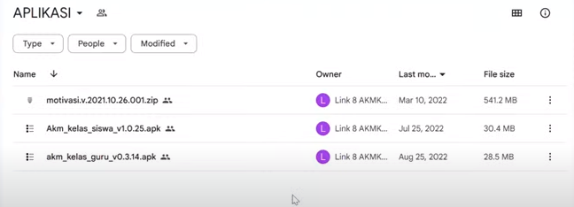
adalah yang paling atas untuk desktop (motivasi) (541 MB).

menu paket tes pada platform
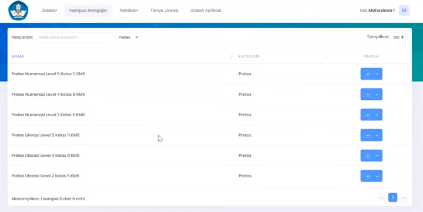
adalah paket soal yang diunakakan untuk pretest di sekolah, sehingga mahasiswa tidak usah membuat soal sendiri, sudah disiapkan dari pusat. 
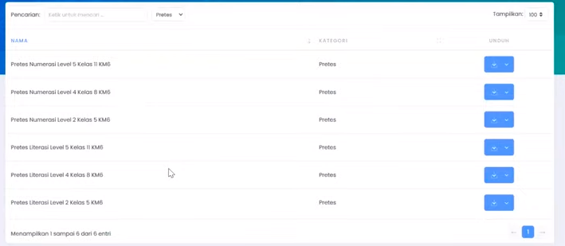
jika install yang dekstop, maka unduh yang paket versi desktop. berbentuk zip

paket tersebut di import melalui aplikasi yang tadinya sudah diunduh (motivasi).

isi dari folder motivasi, pastikan sesuai seperti pada gambar dibawah
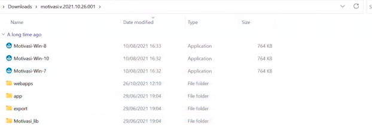
jalankan aplikasi sesuai sistem operasi windows sekolah. apabila sudah menggunakan windows 11, maka gunakan windows 10. tampilan aplikasi
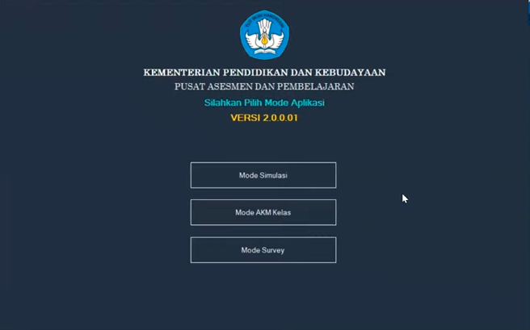

pilih menu kedua (mode AKM kelas), peninjauan kesiapan komputer
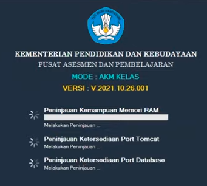
apabila ada yang silang merah, tutup aplikasinya kemudian tutup aplikasi lain yang sedang berjalan (mengurangi beban kerja komputer) 
kemudian klik selanjutnya
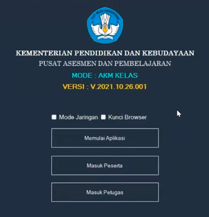
checklist mode jaringan
kunci browser digunakan untuk mengunci browser sehingga siswa tidak bisa beralih jendela lain, ini hanya bisa digunakan ketika dalam mode offline. 
kemudian pilih memulai aplikasi
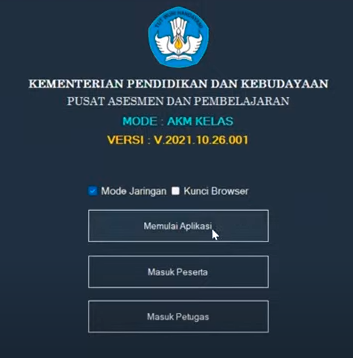
sehingga akan menjadi seperti ini, penanda aplikasi sedang berjalan, jangan klik lagi hentikan aplikasi 
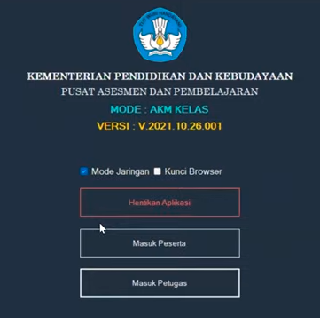
kemudian pilih **masuk ke menu petugas** akan diarahkan ke browser
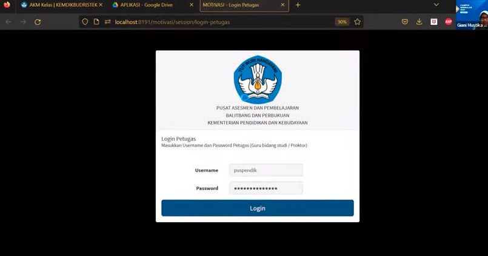
username: **puspendik**
pas : **puspendik@2018**
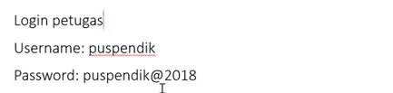
tampilan halaman petugas
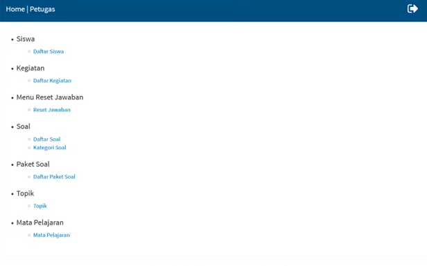
Menu daftar siswa: perlu memasukkan daftar siswa yang akan mengikuti test
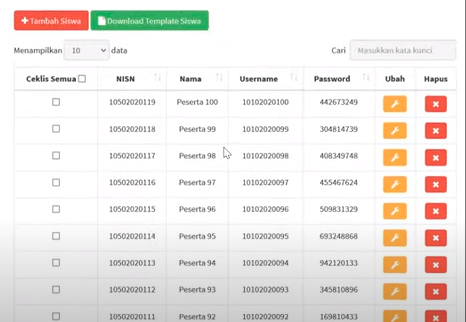
untuk menambahkan data, ada dua cara 1) manual: satu persatu dengan klik tambah siswa. data yang perlu dimasukan yaitu NISN dan Nama siswa sehingga otomatis akan tergenerate username dan password untuk siswa tersebut. atau 2) Excel: download templete siswa kemudian masukkan NISN dan Nama siswa
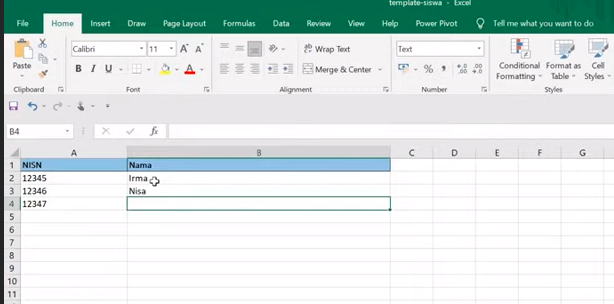
kemudian simpan, dan pilih impor data siswa dan import
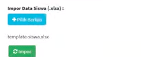

jika sudah memasukkan nama siswa, kemudian memasukkan paket tes melalui daftar kegiatan

kemudian pilih import kegiatan
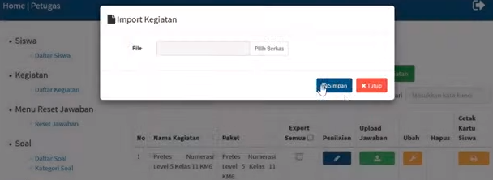
pilih soal yang tadi diunduh pada platform tadi (zip). sehingga akan muncul pada baris paling atas

kemudian perlu menchecklist daftar siswa yang akan mengikuti pretest. pada bagian **ubah** akan muncul daftar siswa yang sudah dimasukkan tadi
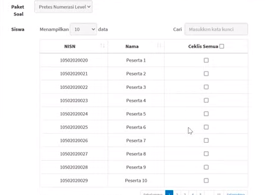
kemudian simpan. selanjutnya ceak kartu siswa

yaitu pada folder ini

bentuknya seperti ini
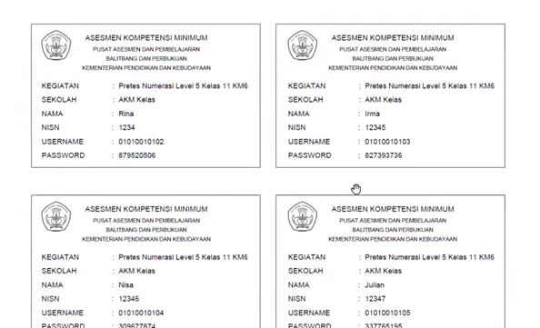
bisa dibagikan sesuai namanya (printout). nana sekolah dietdit seuai nama sekolah pada aplikasi. 

## Cara siswa mengerjakan pretest
## 1. Mode Jaringan 
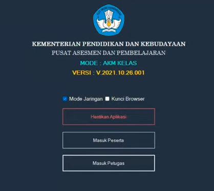
ada satu komputer yang digunakan sebagai server lokal, harus dijalankan dalam posisi dibawah dan tidak boleh tertutup
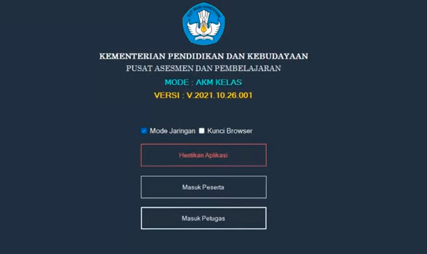
sedangkan pada komputer siswa cukup membuka browser biasa (chrome, atau firefox). kemudian ambil ip addres pada aplikasi pada pojok bawah
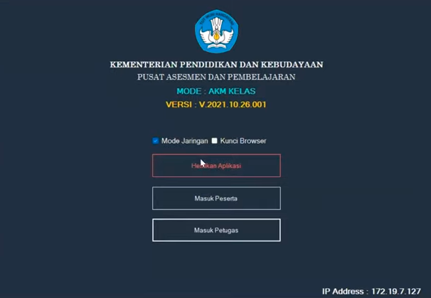
di komputer siswa (client), masuk ke aplikasi menggunakan alamat dibawah ini

sehingga akan didapatkan tampilan sebagai berikut
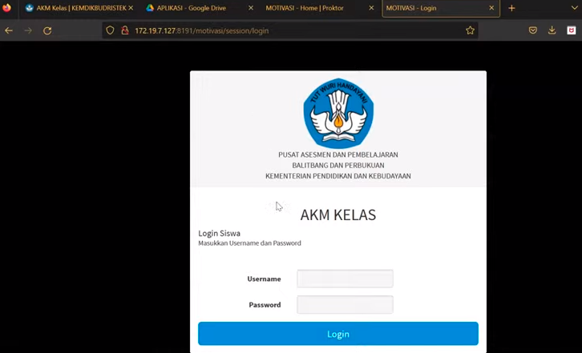
komputer siwa tidak perlu menjalankan aplikasi motivasinya **cukup buka browser dan masuk ke alamat ip addres komputer server**
ketika siswa sudah selesai mengerjakan semua soal, otomatis hasil jawaban akan masuk ke komputer server (kelebihan mode server lokal)
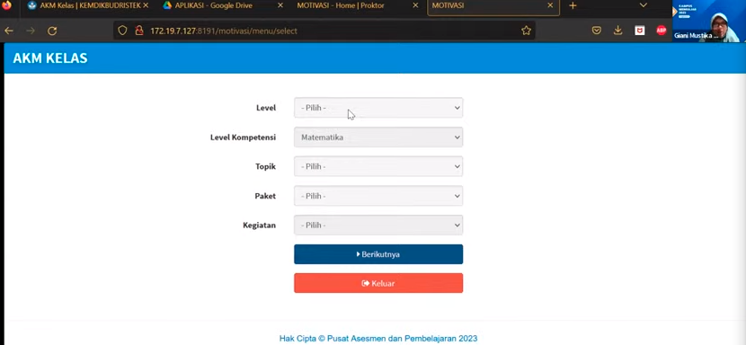
silahkan siwa dipandu untuk menyesuaikan form seperti pada gambar. 
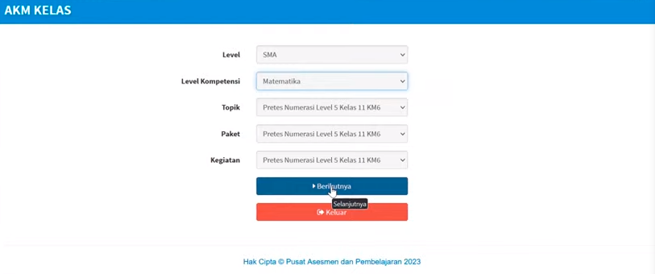
klik berikutnya, kemudian masukkan tokken **123** 
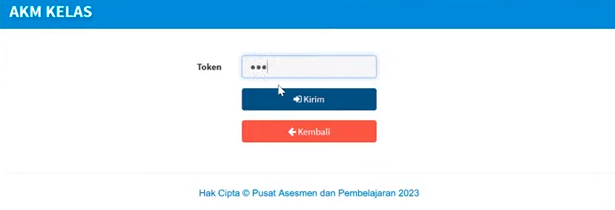
akan masuk ke pendahuluan
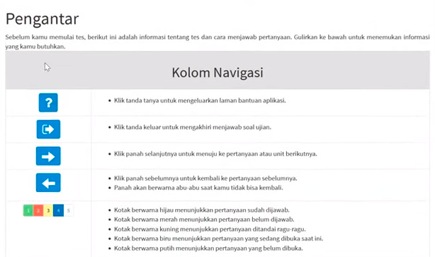
setelah selesai membaca pendahuluan akan diminta konfirmasi lagi
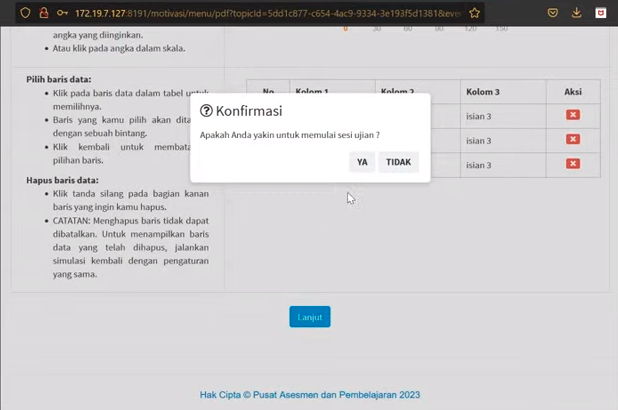
tampilan soal
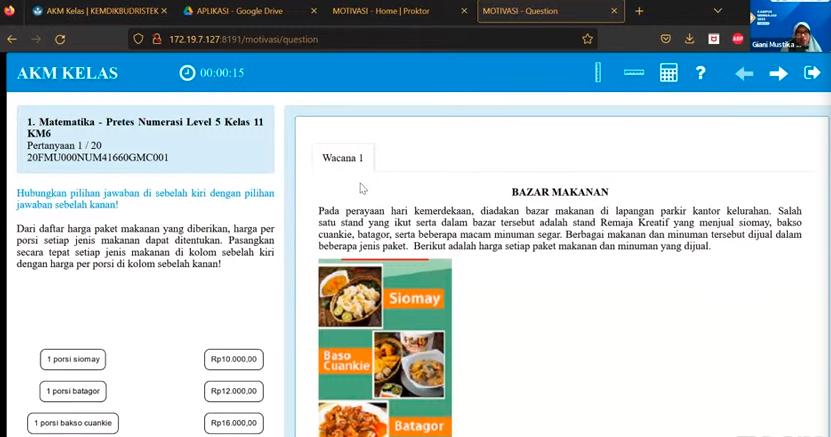
pilihan ada di sisi kiri
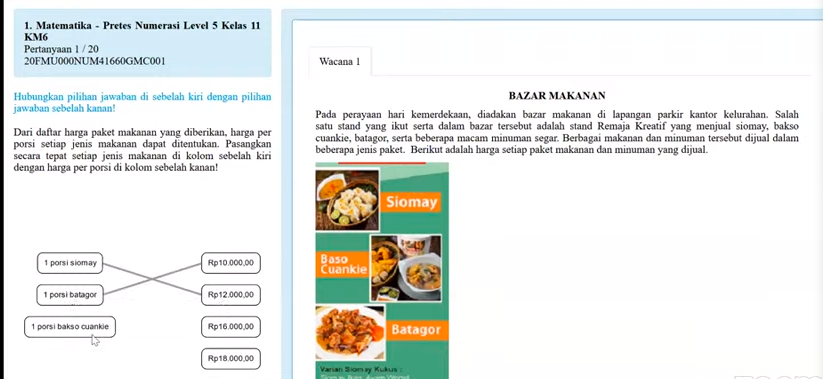
kemudian setelah mantap pilih tombol selanjutnya (panah kanan atas)

>jika sudah dikerjakan berubah hijau.
belum dikerjakan bewarna merah.
lokasi anda saat bewarna biru. 

untuk mengakhiri ujian tombol keluar maka akan dimintai konfirmasi ulang

sehingga akan dikembalikan ke tampilan awal
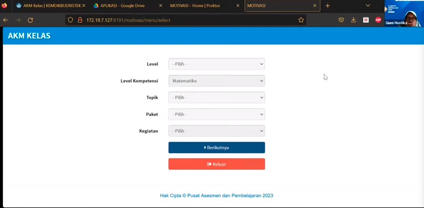

### Mengecek Jawaban siswa
apakah sudah masuk ke komputer server atau belum. yaitu disimpan dalam folder dibawah ini

akan berbentuk file zip, belum berbentuk score
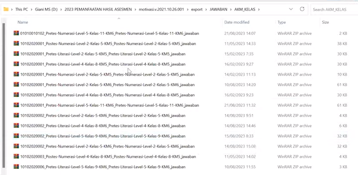
jumlah file akan sesuai dengan jumlah siswa yang mengerjakan. nama file berisi username siswa dan diikuti nama paketnya. 

### melakukan penscoran jawaban siswa:
adalah dengan masuk alamat berikut
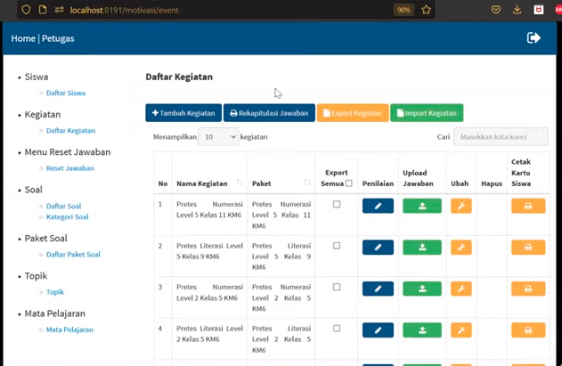
pilih upload jawaban
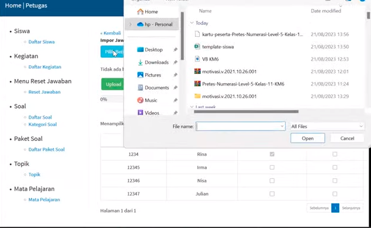
dan pilih hasil jawaban yang tadi diperoleh 
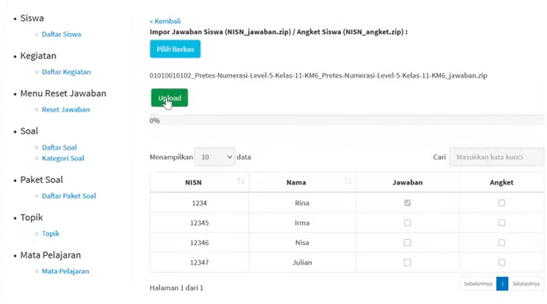
apabila lebih dari satu file, anda bisa secara langsung memilih semua file tadi dan di upload secara bersamaan. (tidak perlu upload satu persatu jawabanya)
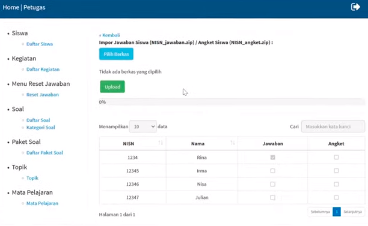
kemudian masuk ke menu penilaian **passwodnya 123456**
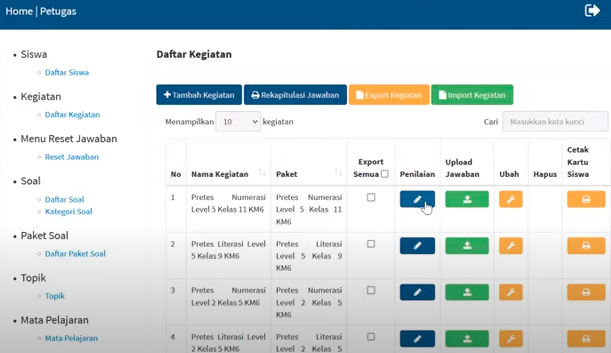
pilih ekspor hasil penskoran AKM kelas
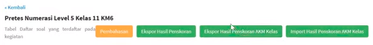
maka akan tersimpan dalam folder berikut
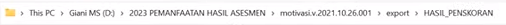
akan ditemui file Excel, dengan nama adalah paket pretestnya
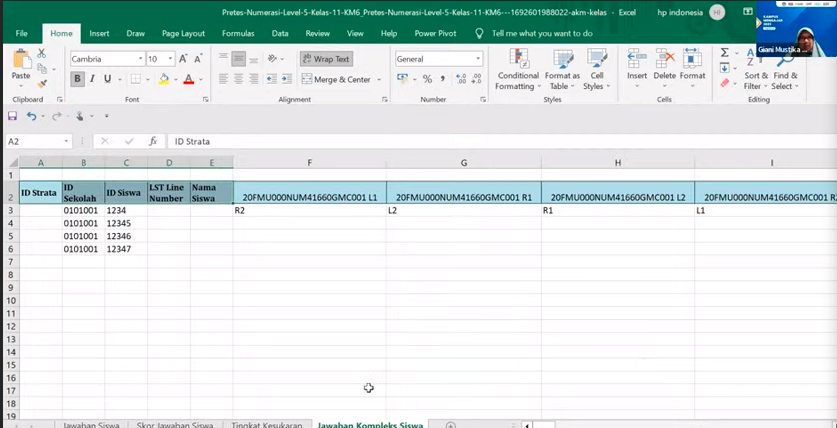
akan tampil jawaban siswa saja, belum muncul nilai. anda perlu mengunggah excel tersebut ke web AKM kelas untuk dilakukan penscoran secara otomatis. 
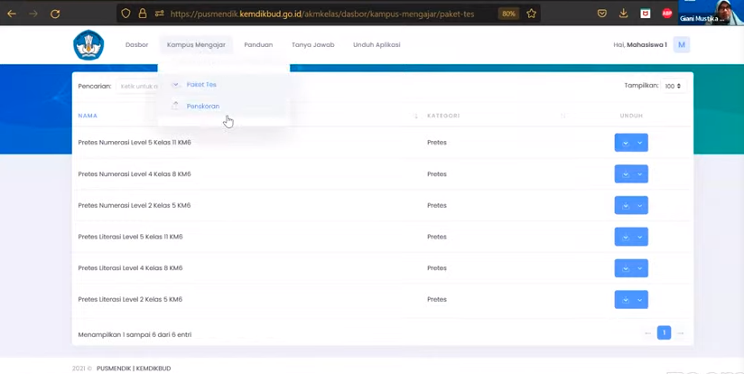
pilih unggah hasil AKM
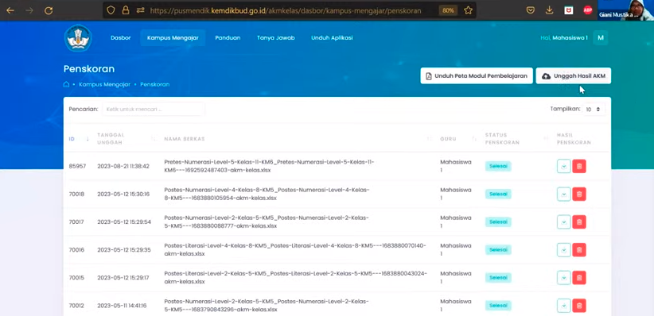 
dan masukkan berkas excel tadi. 
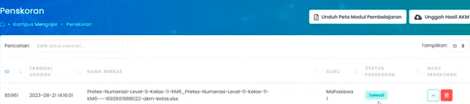
1 hari kok statusnya tidak berubah? karena banyak yang antri. jika sudah selesai bisa dicek bisa diunduh 
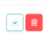
maka akan tersimpan pada folder downlaod komputer anda. tampilanya akan seperti ini
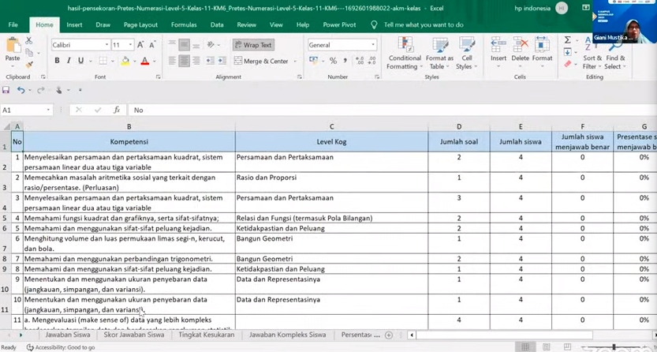
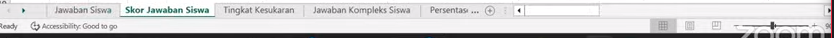
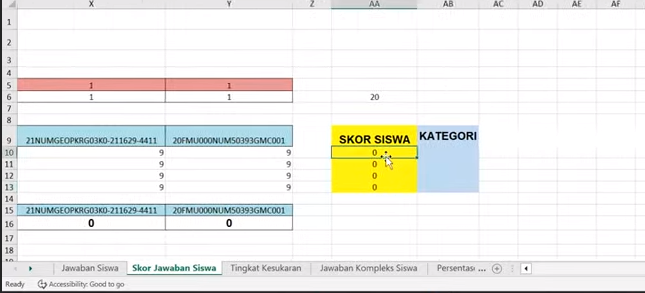
skor siswa ditampilkan dalam skala 100. 

analisis soal
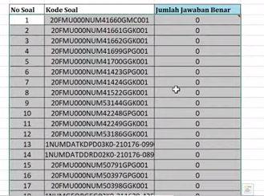.

**Hasil penskoran dapat digunakan untuk evalusi untuk membuat pembelajaran yang lebih baik**

*diakhir program kampus mengajar akan ada post test dengan tentunya siswa yang sama. apakah ada perbaikan kompetensi siswa. (mengetahui dampak)*

## 2. Mode Offline
(stand alone) hanya sedikit berbeda, anda perlu mengkopi satu folder aplikasi motivasi 

yang sudah lengkap (nama siswa, paket dll) dan kemudian di taruh di masing masing laptop siswa.
kemudian menjalankan aplikasinya dan masuk ke sini 

dan jawaban akan tersimpan di masing-masing komputer siswa

# B. Menggunakan Android

unduh aplikasi

pilih link yang masih bisa bekerja

pilih aplikasi ini

pada folder ini

install

pilih formatif, sehingga didapatkan berikut

## Mode Jaringan
pastikan komputer server dalam posisi ON, masukkan IP addres komputer server pada kolom yang sudah disediakan. misal

masukkan NISN sesuai kartu yang tadi dibagikan

maka akan muncul paket yang perlu dikerjakan oleh siswa, kemudian klik unduh dan import
sehingga akan muncul tampilan berikut

diberikan pendahuluan

wacana soal dapat diklik pada tombol warna hijau

nomor soal yang mau dikerjakan dapat dipilih

setelah itu di ekspor untuk dianalisis pada komputer server, bisa memilih alamat ip atau lewat file

apabila di ekspor lewat alamat ip, maka hasilnya dapat dilihat pada folder aplikasi motivasi. 

# FAQ
unggah, cukup satu akun mahasiswa KM6 saja yang mengunggah nilai