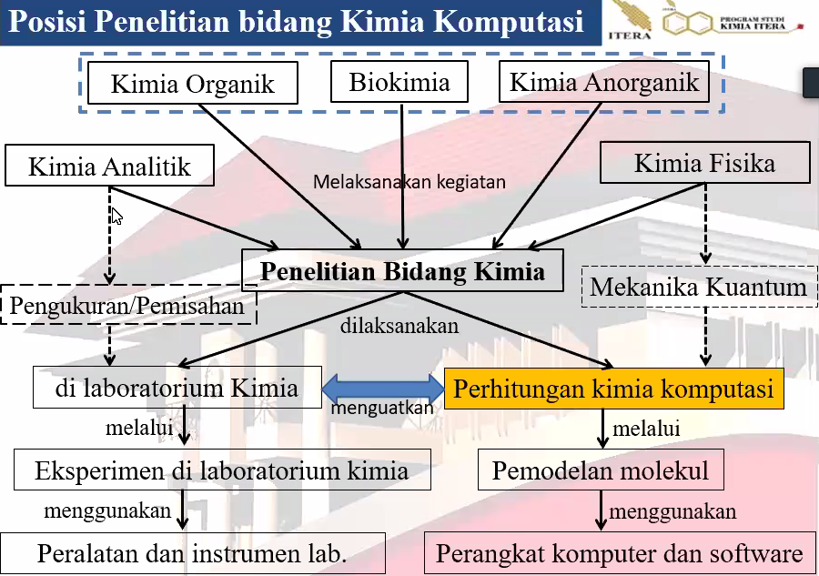
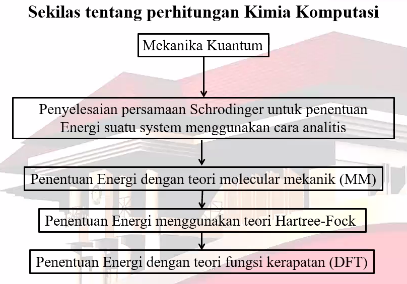
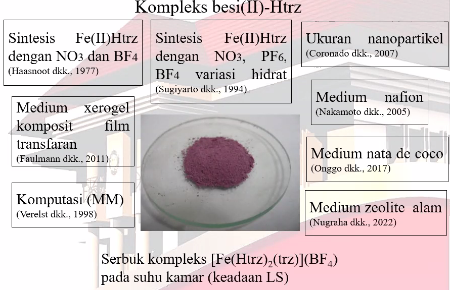
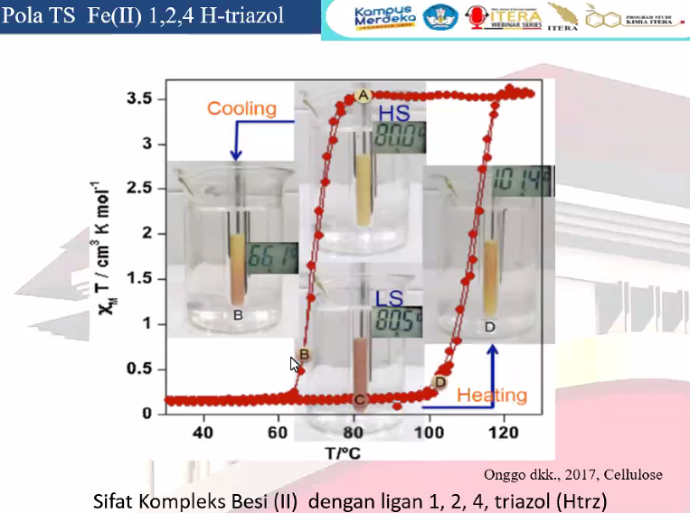
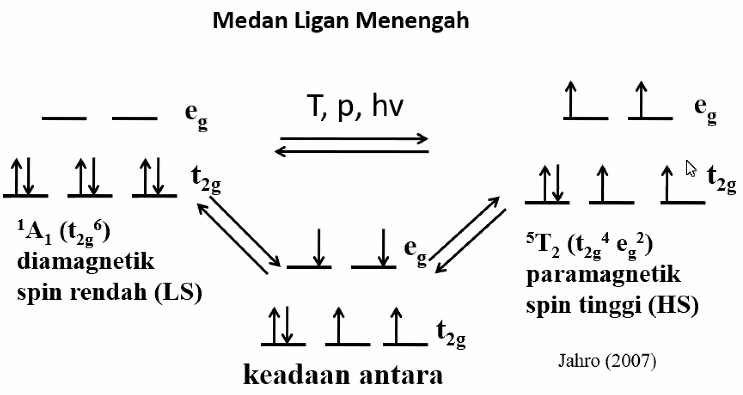

kimia komputasi dapat menguatkan eksperimen basah, seperti model ini mendukung eksperimen tertentu. 

dibawah ini adalah riset yang berkembang dalam komputasi

berbeda sifat dalam suhu yang berbeda. 

ketika temperature rendah, ia bersifat diamagnetik dan dalam temperature tinggi, ia bersifat paramagnetik. disamping warnanya berbeda. 