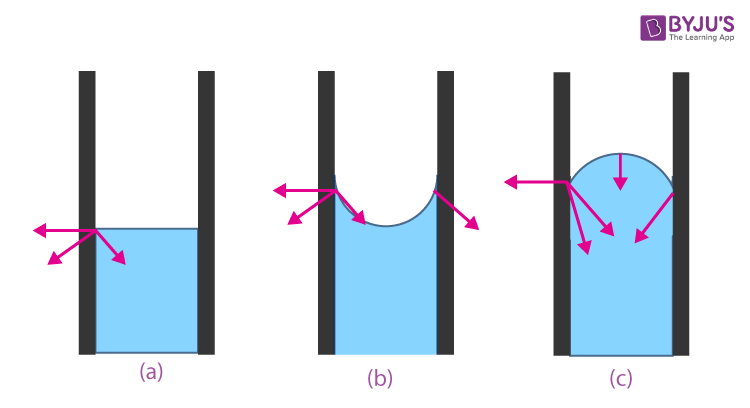

In chemistry, **adhesion is the attraction between molecules of two different substances**. **Cohesion is the attraction between the molecules or atoms of the same substance**. results of electrostatic forces. The cohesive forces are associated with Van der Waals forces and hydrogen bonding

> dari kata "a" dalam adhesion, yang berarti tidak atau berbeda 

gaya adesif dan kohesif menjadi alasan kenapa gelembung dapat terjadi. peningkatan suhu akan meningkatkan gaya adesif. 