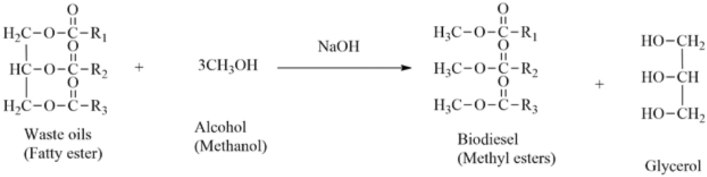
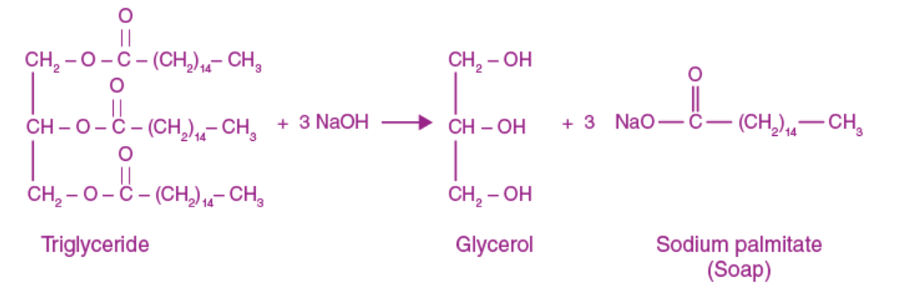

proses pembuatan biodiesel dapat diperoleh dari pencampuran alkohol dengan minyak yang dikatalis oleh basa seperti NaOH. proses reaksi ditunjukkan sebagai berikut

mirip seperti reaksi saponifikasi berikut
