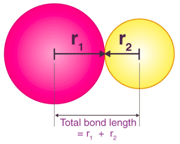

panjang ikatan mengukur jarak inti dari dua ikatan atom pada suatu molekul. kira-kira sama dengan jumlah jari-jari  dari dua atom yang terikat secara kovalen. 

ilustrasi diatas menunjukkan bahwa panjang ikatan kovalen adalah  jumlah jari jari dari radius atom yang berpartisipasi. dalam table periodik, peningkatan atom mengalami peningkatan jari jari ketika periode semakin tinggi dan mengalami penurunan keika group semkain tinggi. 

atom yang terikat cenderung menyerap energi panas dari lingkunganya dan menyebabkan molekul terus bervibrasi. 