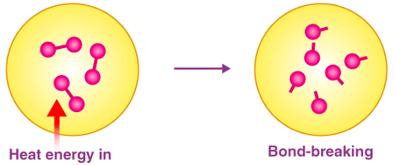

energi ikatan dikenal juga dengan entalpi ikatan. 

energi ikatan adalah ukuran kekuatan dari suatu ikatan kimia. dapat didefenisikan sebagai energi yang diperlukan untuk memutus semua ikatan kovalen dari jenis tertentu dalam satu mol senyawa kimia (keadaan gas)

energi ikatan tidak sama dengan energi disosiasi ikatan. 

Faktor yang mempengaruhi energi ikatan. kekuatan ikatan kimia berbanding lurus dengan jumlah energi yang dibutuhkan untuk memutuskanya. semakin tinggi orde ikatan maka semakin tinggi energi ikatan yang tinggi pula (energi yang diperlukan untuk memutus). perbedaan keelektronegatifan juga berpartisipasi dalam energi ikatan. 

Kekuatan ikatan antara dua atom meningkat dengan meningkatnya jumlah pasangan elektron dalam ikatan. alasan ikatan rangkap tiga adalah lebih kuat.

