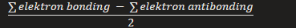
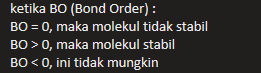

ikatan kovalen dapat dicirikan berdasarkan beberapa parameter ikatan seperti panjang ikatan, sudut ikatan, orde ikatan, dan energi ikatan (entalpi ikatan). parameter tersebut memberikan wawasan tentang stabilitas senyawa kimia dan kekuatan ikatan atom.

ORDER BOND, DALAM ORBITAL MOLEKUL
didefenisikan sebagai selisih antara jumlah elektron bonding dengan jumlah elektron antibonding dibagi 2 atau setengahnya, sehingga secara matematis dapat ditulis seperti ini :

Ketika BO: 
BO = 0, maka molekul tidak stabil
BO >  0, maka molekul stabil
BO < 0, ini tidak mungkin

Bond Order yang semakin besar menghasilkan ikatan yang semakin pendek, maka energi untuk memutus semakin besar, maka semakin stabil.