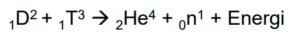
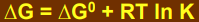
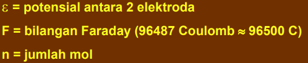
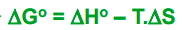

sub-disiplin dari termodinamika yang berkaitan dengan perubahan energi dan etropi dari makhluk hidup dan komponen-komponenya

Bionergetika meliputi
1. kontraksi otot
2. trasport aktif
3. fosforilasi
4. fotofosforilasi
5. katalis enzim

interkonversi adalah perubahan bentuk energi satu ke energi lain. 

Reaksi fusi dalam matahari berasal dari reaksi antara ditrium dan titrium

dalam reaktor nuklir terjadi reaksi fisi dengan pengendali reaksi fisi adalah cadmium sebagai penangkap neutron. 

satuan energi joule atau kalori masing-masing dapat dikonversi. 

Energi aktivasi (Ea) adalah energi minimum yang dimiliki suatu zat supaya memiliki tumbukan sehingga menghasilkan reaksi. digunakan enzim untuk menurunkan energi aktivasi. 

**misalnya pada hidrolisis** sukrosa yang dikatalis oleh ion H+ energi pengaktifan sebesar 25.560 kalori, tetapi bila dikatalis oleh enzim invertase besarnya energi pengaktifan turun menjadi 9000 kalori.

Reaksi spontan atau tidak spontan? dilihat dari delta G (energi bebas gibss). 
1. konstanta keseimbangan, .
2. Elektromotive force, . . perlu mencari nilai epsilon terlebih dahulu. konsentrasi oksidator (konstanta) dan konsentrasi reduktor diketahui sama (yaitu 2). 
3. Data termodinamika, rumus umum . apabila dalam keadaan standar. . ralat, seharusnya delta S nol. 

dari ketiga tersebut, memilih mana yang paling mudah untuk menghitung delta G. 