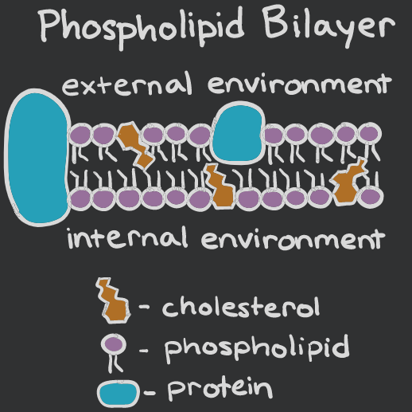
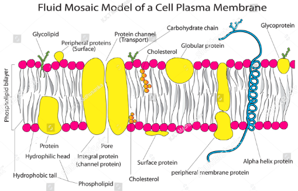

 gambar secara umum

1. two unit membrane model
terdiri dari dua lapis tipis (membran bi layer), ini adalah model generasi pertama model ini tidak dapat menjelaskan bagaimana mekanisme transportasi terjadi. 

2. bilayer model with polipeptide chain in the hydrocarbon phase. protein terletak pada bagian dalam yang hidrofobik. 

3. model bilayer dengan penetrasi rantai polipeptida (menekan kedalam oleh polipeptida). ini menjelaskan bahwa partikel mencari jalan tikus sendiri daripada jalur baku. sehingga ekor-ekor itu tidak berperan dalam masukya suatu partikel
4. model dalam bentuk globular, yaitu lipid berbentuk misel (busa)
5. protein crystal model
merupakan modifikasi dari protein membrane, dimana protein berinteraksi dengan bagian hidrofobik yang non polar dan bagian hidrophile yang polar (berinteraksi dengan medium), sehingga protein tersebut memnuhi ketebalan membran. struktur protein sedemikian lebar sehingga memenuhi spanning lipid bilayaer dan protein terdiri dari dua bagian hidrophile dan hidrofobik

6. model keenam, yaitu yang dipakai sekarang. yaitu model fluid mosaic. model ini secara dapat menerangkan mekanisme transport membran. dari kata mozaic yang artinya acak. 

integral protein yang membentang dari luar kedalam, sedangkan periperal adalah yang menempel pada permukaan membran