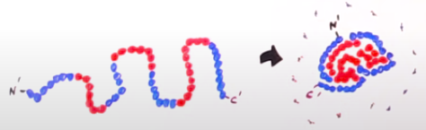

adalah tingkat struktur yang lebih kompleks dari struktur primer dan struktur sekunder. Struktur tersier protein menjelaskan bagaimana rantai polipeptida melipat dan berinteraksi untuk membentuk bentuk tiga dimensi yang khas.

faktor yang berperan paling penting dalam struktur tersier adalah **interaksi hidrofobik**. Karena sebagian protein dalam tubuh terlipat dan menciptakan struktur tersier dalam larutan berair yang didominasi oleh air. faktor lain yang berperan dalam pembentukan struktur tersier protein adalah interaksi van der waals

protein adalah polipeptida yang terbentuk dari 20 asam amino, setiap asam amino memiliki rantai samping yang berbeda. terdapat rantai samping non polar yang bersifat hidrofobik dan rantai samping polar yang bersifat hidrofilik. 

asam amino bewarna biru adalah asam amino yang memiliki rantai samping yang bersifat di hidrofilik (suka air) dan warna merah hidrofobik (tidak suka air). sehingga ketika menempatkan protein tersebut kedalam air akan terbentuk sebuah gumpalan dengan permukaan luar yang didominasi oleh asam amino yang memiliki rantai samping hidrofilik, sehingga akan stabil secara termodinamika.

### Efek hidrofobik
contoh asam amino yang mengandung gugus hidrofobik (non polar)
- valin
- alanin
- leusin
- isoleusin
- metionin
- triptofan
- fenil 
- alanin

contoh asam amino yang mengandung gugus hidrofilik (polar)
- linin
- arginin
- aspartat

beberapa asam amino membawa muatan pada rantai sampingnya

muatan positif
- lisin
- arginin

muatan negatif
- aspartat