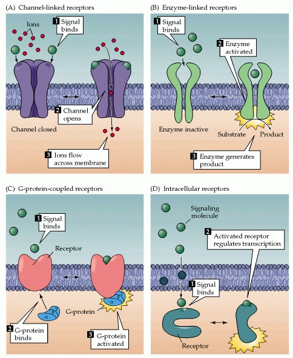

respons ditentukan oleh adanya reseptor yang secara spesifik mengikat molekul pemberi singal. pengikatan molekul singal menyebabkan perubahan konformasi pada reseptor yang kemudian memicu kaskade pensinyalan berikutnya

1. domain ekstraseluler dari reseptor mencakup situs pengikatan untuk singal
2. domain intraseluler mengaktifkan kaskade pensinyalan intraseluller setelah singal berikatan (domain ekstraseluler)

gambar dibawah ini adalah kategori reseptor selluler

### 1. Channel-linked receptor
disebut juga dengan ligand-gated ion channels. interaksi molekul singal dengan binding site pada reseptor menyebabkan buka atau tutup ion channel pore in another part od the same molecule. contohnya adalah reseptor neurotrasnmitter
### 2. Enzyme-linked receptor
memiliki tempat pengikatan ekstraseluler untuk singal kimia. domain intraseluler dari reseptor tersebut adalah enzim yang aktivitas katalitiknya diatur oleh pengikatan singal ekstraseluler. contohnya adalah tirosin kinase, dengan memfosforilasi protein target intraseluler, sehingga mengubah fungsi fisiologis sel target. tirosin kinase menangkap molekul singal dari keluarga *growth factors*
### 3. G-protein-coupled
atau disebut dengan 7-transmembrane receptors. ini mengatur reaksi intraseluler melalui mekanisme tidak langsung dengan melibatkan molekul transduksi perantara yang disebut protein pengikat GTP (protein G). contohnya adalah reseptor Beta-adregenik, asetikolin tipe muskarininc, reseptor untuk hormon peptida, dan reseptor untuk bau dalam sistem penciuman. contoh konkritnya, Rhodopsine merupakan protein 7-transmembran peka cahya dalam fotoreseptor retina. 

### 4. intraseluler receptors
diaktifkan oleh molekul pensinyalan sel permeant atau lipolifik. banyak dari reseptor ini mengarah pada aktivasi kaskade pensinyalan yang menghasilkan mRNA dan protein baru di dalam sel targer. bentuk reseptor yang teraktivasi kemudian bergerak ke dalam nukleus dan langsung berinteraksi degan DNA inti menghasilkan transkripsi yang berubah. beberapa reseptor intraseluler terletak terutama di sitoplasma, ada juga yang di nukleus