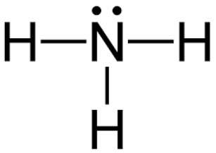

P4 + O2
C + O2
Na + O2
Ba + O2
CO2 + H2O
Na2O + H2O
BaO + OH2O

#### jawab
penyetaraan harus sama antara kanan dan kiri, yaitu jenis atom, jumlah atom, dan muatan total. jangna lupa mencantumkan fasa

terkadang di alam tidak ada, misalnya P4O2, adanya dialam adalah P2O5 atau P2O3

P4(s) + 3O2(g) -> 2P2O3 (s) (difosphor trioksida)
P4(s) + 5O2(g) -> 2P2O5 (s) (difosphor pentaoksida)

C(s) + O2(g) -> CO2(g)
C(s) + 1/2O2(g) -> CO(g)

4Na(s) + O2(g) -> 2Na2O(s) (natrium oksida)

> tidak menggunakan 'di' karena natrium merupakan golongan logam

2Na(s) + 2O2(g) -> 2Na2O2(s) (natrium peroksida)

> 'per' berarti kelebihan pada unsur logam, khususnya oksigen

2Ba(s) + O2(g) -> 2BaO(s) (barium oksida)
2Ba(s) + O2(g) -> Ba2O2(s) (barium peroksida)

```
Non logam + oksigen -> Okgisda Non logam
```

```
logam + oksigen -> Okgisda logam
```

```
oksida non logam + air -> asam
```

```
oksida logam + air -> basa
```

Basa golongan 1A (semua larut) 2A (sedikit larut) seperti Sr(OH)2 atau Ca(OH)2 kecuali Ba(OH)2 tidak larut

Co2 + H2O -> H2CO3 (aq)
```
oksida non logam + air -> asam
```
Na2O + H2O -> NaOH (aq)
```
oksida logam + air -> basa
```
BaO + H2O -> Ba(OH)2 (aq)
```
?
```

***
CaO + SO2
CuO + SO3
CO2 + NaOH
NaOH + CuSO4
MgCl2 + KOH

#### Jawab
CaO(s) + SO2(g) -> CaSO3 (s)
```
oksida logam + oksida non logam -> garam (kalsium sulfit)
```
CuO(s) + SO3(g) -> CaSO4 (s)
```
oksida logam + oksida non logam -> garam (kalsium sulfat)
```
CO2 + 2NaOH - >Na2CO3(aq) + H2O
```
oksida non logam + basa -> garam + air
```
2NaOH + CuSO4 -> Cu(OH)2(s) + Na2SO4
```
basa + garam asam -> basa + garam netral
```
MgCl2(aq) + KOH(aq) -> Mg(OH) + KCl2
```
garam netral (dari asam kuat dan basa kuat) + basa kuat -> basa kuat + garam netral
```
> garam golongan 1A semua larut

CaSO3 kalsium sulfit
CaSO4 kalsium sulfat
Na2CO3 natrium karbonat
Cu(OH)2 tembaga (ii) hidroksida
Cu(OH) tembaha (i) hidroksida
MgCl2 magnesium klorida

***
Timbal asetat + kalium iodida
Amonium kromat + perak nitrat
**jawab**
Pb(CH3COO)2(aq) + 2KI(aq) -> PbI2(s) + 2CH3COOK(aq)
```
timbal(ii)asetat + KI -> timbal(ii)iodida + kalium asetat 
```
> disebut persamaan molekuler
```
muatan timbal masih sama, ketika ditulis dalam ion sebagai berikut
```

Pb2+ + CH3COO- + 2K+ 2I- -> PbI2 + 2CH3COO- + 2K+

> disebut persamaan ionisasi

Pb2+ + 2I- <=> PbI2

> disebut persamaan total, ketika ion ion saling meniadakan

NH4CrO4 + 2AgNO3 -> AgCrO4 + 2NH4NO3 
> disebut persamaan molekuler

2NH4+ + CrO42- + 2Ag+ + 2NO3- -> Ag2CrO4 + 2NH4+ 
> disebut persamaan ionisasi

CrO42- + 2Ag+ <=> Ag2CrO4
> disebut persamaan total

`catatan`
- semua garam nitrat larut dalam air
- semua garam amonia larut dalam air
- reaksi bolak balik `<=>` adalah ketika produk berupa endapan. 

***
## Reaksi pembentukan senyawa atau ion kompleks
Cu 2+ + 6H2O
Cu 2+ + 4CN -
Cu 2+ + 2NH3
**jawab**
[Cu(H2O)6]2+
[Cu(CN)4]2-
[Cu(NH3)2]2+

bilangan oksidasi Cu adalah 2+
bilangan koordinasi Cu 2, 4, atau 6


ada satu pasangan elektron bebas NH untuk dipakai bersama dengan Cu. 

monodental, molekul yang memiliki 1 pasangan elektron bebas
didental, molekul yang memiliki 2 pasangan elektron bebas
polidental, molekul yang memiliki > 2 pasangan elektron bebas
logam yang biasa dapat berperan sebagai ion pusat yaitu logam golongan transisis (golongan B)

> dibentuk antara ion pusat (logam) dengan ligan

> senyawa kompleks adalah senyawa yang memiliki ikatan kovalen koordinasi

> syarat ligand adalah memiliki pasangan elektron bebas (dapat dilihat dari struktur lewis)

Fe 2+ + SCN-
bilangan koordinasi 2: [Fe2(SCN)2]
`garam ditiosianat besi(ii)`
bilangan koordinasi 4: [Fe2(SCN)4]2-
`ion tetratiosianat besi(ii)`
bilangan koordinasi 6: [Fe2(SCN)6]4-
`ion heksatiosianat besi(ii)`