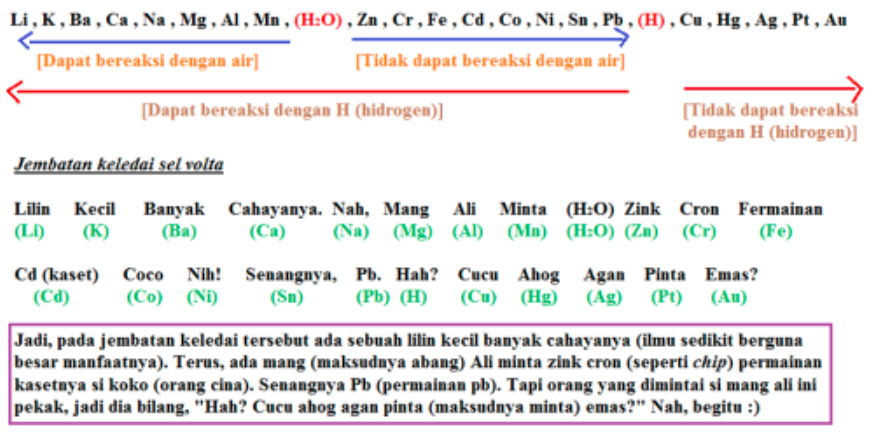

Na + HCl 
Fe + HCl
Cu + HCl

**jawab**
Na(s) + 2HCl(l) -> NaCl2(s) + H2(g)
Fe(s) + 2HCl(l) -> FeCl2(s) + H2(g)
Cu(s) + 2HCl(l) =/ **TIDAK BEREAKSI** | dilihat dari deret volta, dimana Cu tidak bereaksi dengan H

`logam + asam -> `
Na adalah golongan 1A merupakan logam paling reaktif. logam golongan 2A juga reaktif

Na + H2O -> NaOH + H2
`logam 1A`
Ba + H2O -> Na(OH)2 +H2
`logam 2A`
Ba + HNO3 -> Ba(NO3)2 + H2
`logam 2A`

#### Bilangan oksidasi
Na(s) + 2HCl(l) -> NaCl2(s) + H2(g)
	0			+1			+1				0
oksidasi: zat yang mengoksidasi: HCl
reduksi: zat yang mereduksi: Na
	
Fe(s) + 2HCl(l) -> FeCl2(s) + H2(g)
	0			+1			+2				0
oksidator HCl
reduktor Fe
	
### Deret elektrokimia atau volta

deret volta sebenarnya berkaitan dengan redoks

Fe -> Fe2+ + 2e-			E0 oksidasi
2H+ + 2e- -> H2				E0 reduksi
____________________________ +
Fe + 2H+ -> Fe2+ + H2	Esel

bilangan oksidasi
1. FeCl, bil oksidasi Cl -1
2. HClO, bil oksidasi Cl +1
3. HClO2, bil oksidasi Cl +3
4. HClO3. bil oksidasi Cl +5
5. HClO4, bil oksidasi Cl +7

semakin kebawah maka 
Bilangan oksidasi Cl makin besar
Jumlah Oksidasi makin besar
Sifat asam semakin kuat
Sifat oksidator semakin kuat

H2SO4 encer: oksidator lemah
H2SO4 pekat: oksidator kuat
H3PO3: asam lemah
H3PO4: asam lemah

Ba(s) + H2SO4(pekat) -> BaSO4 + H2
`logam + asam`

oksidator adalah H2SO4, yang mengalami oksidasi adalah Ba

## Oksidator kuat
- HClO4
- HClO3
- H2SO4
- KMnO4
- K2Cr2O7
- K2CrO4
- H2SO4 pekat
- KMnO4
- HNO3
- HPO3
- HIO3
- HIO4
- KbrO4
- KClO4

## Reduktor kuat
- Logam Golongan 1A dan 2A
- Al, Fe

1. Natrium Oksalat + Kalium Permanganat
2. Besi(ii) Klorida + Kalium Dikromat

**Jawab**
1. FeCl2 + K₂Cr₂O₇
-----
**nomor 1**
tentukan ionya dulu, yaitu oksalat dan permanganat, sebagai berikut
Fe 2+ 
CrO7 2-

ketika mengalami oksidasi (bentuk lebih stabil)
Fe 2+ -> Fe 3+
CrO7 2- -> Cr 3+

> dilihat dari bilangan oksidari Fe dan Cr, diantara beberapa bilangan yang dimiliki unsur tersebut mana yang paling stabil

setarakan
Fe 2+ -> **Fe 3+ + e**
CrO7 2- **+ 14H + 6e**  -> 2Cr 3+ + **7H2O**

> ketika sisi kanan tidak ada O, maka bisa ditambahkan H2O, dengan konsekuensi sisi kiri ditambah Hidrogen. 2Cr 3+ berarti memiliki 6+ oleh sebab itu disisi kiri ditambah dengan 6e

integrasikan, untuk menghilangkan e
Fe 2+ -> Fe 3+ + e		 | x1
CrO7 2- + 14H + 6e  -> 2Cr 3+ + 7H2O	| x6 

**Pengayaan**
suatu reaksi dengan, ketika mengalami oksidasi bentuk stabilnya seperti ini
Cr2O7 2- -> 2Cr 3+
Cu 1+ -> Cu 2+

> dilihat dari bilangan oksidari Cr dan Cu, diantara beberapa bilangan yang dimiliki unsur tersebut mana yang paling stabil

setarakan
Cr2O7 2- **+14H** -> 2Cr 3+ **+ 7H2O**
Cu 1+ -> Cu 2+ **+ e**

> pada persamaan atas, H2O ditambahkan agar sisi kanan juga memiliki O, konsekuensinya sisi kiri harus ditambah H juga.

> pada persamaan bawah, e ditambahkan pada sisi kanan agar muatan setara

integrasikan, untuk menghilangkan e
Cr2O7 2- +14H +6e -> 2Cr 3+ + 7H2O		 | x1
Cu 1+ -> Cu 2+ + e										| x6 

> metode eliminasi e dengan mencari koefisien yang tepat pada kedua persamaan

hasil integrasi
Cr2O7 2- +14H + **6**Cu 1+ ->  2Cr 3+ + 7H2O + **6**Cu 2+

> reaktan ditambah dengan reaktan, produk ditambah dengan produk dengan memperhatikan hasil perkalian. apabila ada unsur kanan dan kiri yang identik, maka dapat saling meniadakan misalnya e