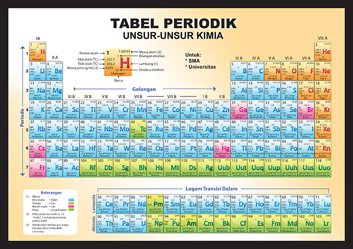

dibagi dalam dua kelompok/golongan, yaitu golongan A dan golongan B. Golongan A, biasa disebut GOLONGAN UTAMA, sedangkan golongan B disebut golongan TRANSISI

> Golongan transisi adalah golongan yang "membelah" golongan utama. Golongan transisi terdiri dari unsur-unsur golongan B

mendefinisikan logam transisi sebagai "sebuah unsur yang mempunyai subkulit d yang tidak terisi penuh atau dapat membentuk kation dengan subkulit d yang tidak terisi penuh"

semuanya adalah logam