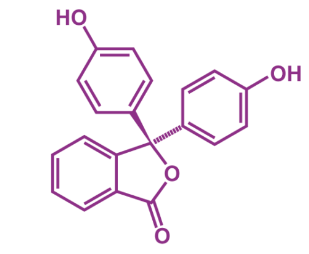
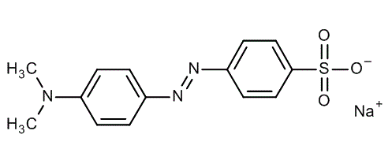
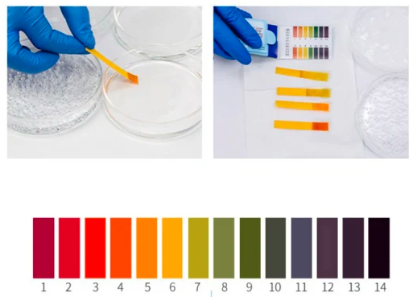

adalah reaksi antara zat yang bersifat asam dan bersifat basa. berikut adalah analit dengan titran yang dapat memberikan indikasi

titran asam kuat, analit basa kuat
titran asam kuat, analit basa lemah
titran asam kuat, analit garam basa

titran basa kuat, analit asam lemah
titran basa kuat, ...

titran asam lemah, analit basa kuat
titran asam lemah, analit basa lemah 
...

> yang penting antara asam dan basa

titran dimasukkan dalam buret, sedangkan erlenmeyer atau titrat berisi indikator, pelarut, pengatur kondisi, dan analit

titran adalah suatu larutan standar, larutan standar sendiri dikategorikan menjadi dua yaitu primer dan sekunder. 

primer: stabil dan kemurnian tinggi
sekunder: dilakukan proses standarisasi

Na2CO3 (adalah garam basa), sebagai larutan standar primer maka akan bereaksi dengan asam.

> Na2B4O4, natrium boraks atau natrium tetraborat, dalam bentuk lab adalah Na2B4O4.10H2O sehingga tidak bersifat hidroskopis karena sudah memiliki banyak air
> H3BO3, asam borat, termasuk asam lemah
> asam benzoat, memiliki gugus karboksilat dimana H pada gugus tersebut dapat lepas sehingga bersiat asam menjadi H+

indikator, alat yang digunakan untuk mengindikasi atau menyatakan perubahan yang dapat diamati. 

Indikator asam basa adalah indikator berupa asam atau basa organik lemah yang dapat berubah warna pada pH berbeda, misalnya PP, MO

*phenopltalin*

*metilorange*, terdapat senyawa amin, bersifat basa lemah

asam lemah dalam air akan terionisasi tidak sempurna (sebagian) atau secara kimia dapat ditulis sebagai 

HA <=> H+ + A-

ada reaksi yang kembali menjadi HA (molekul) ada yang membentuk menjadi H+ + A- (ion)

> pH rendah berarti asam berarti konsentrasi H+ banyak

apabila yang terlibat dalam reaksi tersebut adalah suatu indikator, maka boleh saya tulisakan sebagai 

HInd <=> H+ + Ind-

> Indikator, antara dalam bentuk molekul dan dalam bentuk ion akan berbeda warna

reaksi kesetimbangan diatas dipengaruhi oleh pH, bagaimana anda tahu kalau reaksi diatas dipengaruhi pH, karena disitu ada H+ yang terlibat

kita tahu bahwa, pada pH rendah, maka akan ada banyak H+, oleh karena itu akan menyebabkan kesetimbangan bergeser ke kiri (ke bentuk molekul) menyebabkan indikator berada pada bentuk molekul, berlaku sebaliknya pada pH tinggi, maka akan ada sefikit H+, oleh karena itu akan menyebabkan kesetimbangan bergeser ke kanan (ke bentuk ion) menyebabkan indikator berada pada bentuk ion.

## Warna asam-basa
misalnya indikator timol biru memiliki trayek pH 1,2 - 2,8. yang berarti pada pH < 1,2 merupakan warna asam , pada pH > 2,8 merupakan warna basa
tapi padaal 2,8 masih merupakan pH asam? ya seperti itu hanya pengistilahan saja. 

trayek pH setiap indikator berbeda-beda. dan volume indikator yang dimasukkan akan mengakibatkan pergeseran trayek pH, yang berhubungan dengan reaksi kesetimbangan. umumnya hanya perlu 1 sampai 2 tetes. 

> ide, penentuan titik ekivalensi dengan menandai warna, secera teoritis dengan komputasi kimia, setelah itu dengan deteksi citra yang di signifikankan. 

indikator universal, adalah mempunyai range pH yang lebar bisa dari 0 sampai 14. adalah dengan mencampurkan beberapa indikator. misalkan mencampurkan indikator berikut, dengan mempertimbangkan range trayek pH mereka

1. pentamethoxy red: 1,2 - 2,3
2. 2,4-dinitrophenol: 2,4 - 4,0
3. bromcresol green: 4,0 - 5,6
4. bromphenol blue: 6,2 - 7,6
5. tropeolin: 7,6 - 8,9

sehingga indikator universal tersebut memiliki trayek pH antara 1,2 sampai 8,9. semakin banyak indikator yang digunakan akan lebih akurat. misalnya ada indikator universal yang memiliki range 0 -14 dengan hanya mencampurkan 4 indikator. 

indikator universal

dengan mencelupkan kertas pada larutan indikator

indikator merupakan asam atau basa yang bersifat lemah. 

indikator kertas, tidak memiliki trayek pH hanya dapat membedakan antara basa dan asam dengan menunjukkan perubahan warna. 

***
Standarisasi HCl dengan natrium borat
pertama natrium borat diberi indikator pp, menghasilkan NaCl (merupakan garam netral) ada juga Na2CO3 beraksi dengan HCl mengasilkan NaHCO3 yang bersifat garam basa, oleh karena garam basa maka indikator yang diberikan pertama adalah pp. campuran NaOH dan Na2CO3 bersifat basa, apabila diberikan indikator pp maka akan berubah warna ungu, titrasi dengan HCl sampai warna hilang, kemiudian beri indikator mo, 