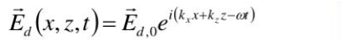
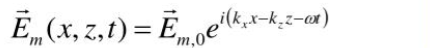
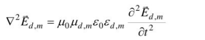
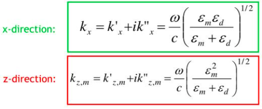

Asumsi medan elektromagnetik adalah gelombang yang merambat sepanjang antarmuka (sumbu x) dan berkurang secara eksponensial menjauh dari antarmuka (sumbu z)

Menggunakan ansatz untuk medan listrik dan medan magnet dalam bentuk gelombang berjalan

medan listrik pada medium dielektrik

medan listrik pada medium logam

dengan kx adalah bilangan real, dan kz adalah bilangan imajiner. 

Melalui persamaan maxwell, didapat persamaan gelombang secara umum

dalam kasus ini, persamaan gelombang menjadi 

Substitusi gelombang surface plasmon + boundary conditions sehingga didapatkan dispersion relations

Ref [*](https://www.slideserve.com/lorenzo-romero/nanophotonics-class-2-surface-plasmon-polaritons) [*](http://large.stanford.edu/courses/2007/ap272/white1/)

