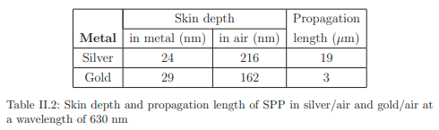
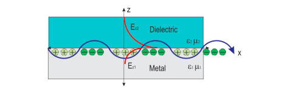

Komponen normal vektor gelombang (k) harus murni imajiner pada semua medium yang memberikan solusi menghilangnya gelombang elektromagnetik secara exponen, seperti pada kutipan dibawah:

> *ketika ω < ωp, maka konstanta dielektrik bernilai negatif sehingga index refraktif berupa bilangan imajiner artinya gelombang elektromagnetik dapat merambat di dalam medium hanya sampai kedalaman tertentu.*

Sehinga propagasi gelombang elektromagnetik pada sepanjang interface dapat diperoleh. 

Oleh karena itu, mudah untuk membuat kondisi ini terpenuhi yaitu ketika ε1 < 0 dan ε2 > 0 (atau sebaliknya). Dengan kata lain, salah satu dari fungsi permitivitas dielektrik bernilai negatif. 

umumnya, material yang memenuhi kondisi ε < 0 adalah logam atau semikonduktor terdoping N tinggi. Hubungan tersebut dapat menjelaskan bahwa konstanta propagasi dari plasmon permukaan lebih besar daripada gelombang vektor dari sinar didalam medium dielektrik. 

Panjang popagasi plasmon permukaan dan pengurungan medan elektromagnetik pada dua media dapat dijelaskan ketika dispersi plasmon permukaan dihubungkan dengan komponen normal vektor gelombang. 

pengurungan (*confinement*) medan elektromagnetik atau dikenal dengan "skin depth" didefiniskan sebagai jarak ke antarmuka dimana amplitudo evanescent berkurang menjadi 1/e. skin depth dielektrik dan logam dituliskan sebagai

sedangkan panjang propagasi sepanjang antarmuka dapat didefiniskan setelah intensitas menurun ke 1/e

berikut merupakan tabel skin depth dan panjang propagasi relatif Surface Plasmon Polaritons pada antarmuka logam-udara dengan sinar panjang gelombang 630nm

ilustrasi evanescent yang diwakili garis merah memiliki panjang yang berbeda pada medium dielektrik dan medium logam oleh karena memiliki ε dan μ berbeda.

Ref: [Assembly af A Surface Plasmon Resonance (Spr) Spectrometer For The Characterization of Thin Organic Films](https://www.maxwell.vrac.puc-rio.br/colecao.php?strSecao=resultado&nrSeq=35147@2)