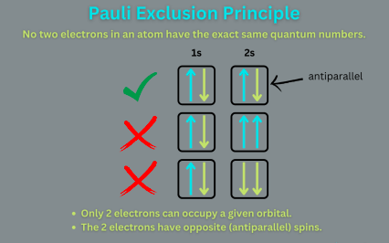
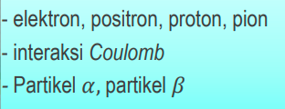
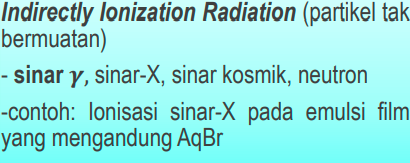

foton merupakan salah satu dari partikel elementer. foton tidak bermassa, namun memiliki momentum oleh karena itu foton dapat dipengaruhi oleh gafitasi. tetapi tidak dapat dibelokkan oleh medan elektromagnetik karena tidak memiliki muatan listrik. energi foton dirumuskan sebagai 

E = hc/lamda

dimana h adalah konstanta planck, c kecepatan cahaya, dan lamda adalah panjang gelombang photon

poton mematuhi prinsip pengecualian pauli sebagai berikut

prinsip eksklusi pauli juga mengatakan bahwa, jika terdapat keadaan kosong pada suatu tingkat energi tertentu, maka satu dan hanya satu elektron dapat mengisi tempat tersebut	

## Radiasi Ionisasi
dibedakan menjadi radiasi ionisasi langsung dan tidak langsung. 

*radiasi ionisasi langsung*

*radiasi ionisasi tak langsung*

berikut adalah karakteristik radiasi ionisasi tak langsung
1. foton menghasilkan pasangan elektron positron interaksi coulomb dengan atom disekitarnya
2. fotolistrik: foton menghilang
3. efek compton: foton terhambur
4. produksi pasangan: elektron dan positron yang terbentuk dari foton yang berinteraksi dengan medan listrik hilang atau elektron berenergi tinggi mengenai inti (ionisasi tidak langsung)

