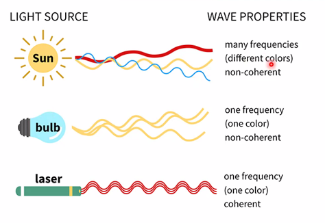
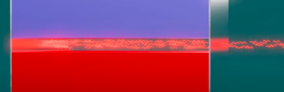
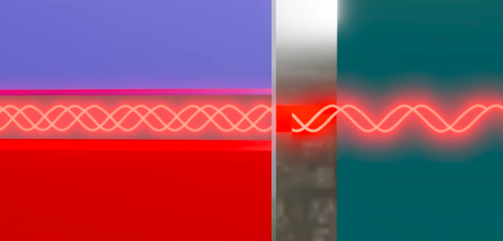
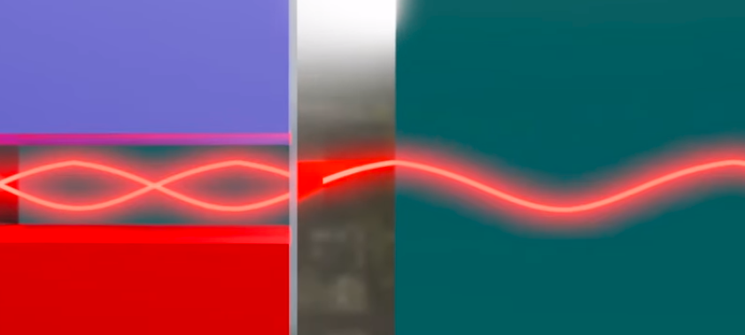

Laser memancarkan foton dengan panjang gelombang hampir tunggal (monokromatik). Sifat tersebut menjadikan alat yang ideal untuk menyimpan energi foton ke wilayah yang terlokalisasi.

*perbedaan sumber sinar*

laser tidak hanya koheren secara spasial tetapi juga secara temporal. 

dioda laser tersusun atas semikonduktor p-n junction, ditenah sambungan tersebut ketika dialiri listrik maka atom pada daerah tersebut akan tereksitasi dan setelahnya sebagai akibatnya akan dipancarkan gelombang elektromagnetik dengan panjang gelombang tertentu. 

dalam manufakturnya, gelombang tersebut akan terperangkap dan memantul pada dinding dinding menyebabkan adanya perkuatan karena atom lain akan tereksitasi oleh gelombang elektromagnetik yang dihasilkan oleh atom lain

hanya akan disisakan sedikit celah sehingga laser dapat keluar.

sekaran adalah bagaimana agar sinar yang keluar dapat koheren sercara parsial dan temporal, yaitu dengan menyesuaikan panjang dinding pantulan, sehinnga laser dapat koheren

*tidak koheren*

*koheren*