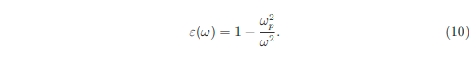
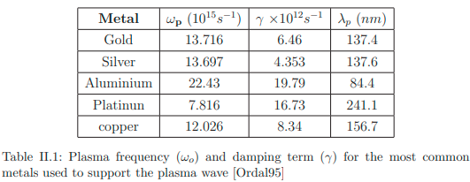

osilasi kolektif elektron bebas di dalam bahan konduktor yang dapat berinteraksi dengan medan elektromagnetik. Persamaan matematika yang terlibat umumnya merepresentasikan respon elektron dalam logam.

Persamaan dasar yang digunakan untuk memahami plasmon permukaan (surface plasmon) adalah persamaan Maxwell, yang diadaptasi untuk permukaan antara dua media, yaitu logam dan dielektrik

# Maxwell equations and dielectric constant of metals
Mekanika kuantum adalah alat terbaik untuk menjelaskan fenomena ini, tetapi mungkin saja menggunakan persamaan elektrodinamika untuk menyederhanakan. Interaksi antara medan elektromagnetik dengan logam dapat dijelaskan dengan persamaan maxwell

ρf adalah densitas muatan luar dan Jf adalah densitas arus luar. melalui persamaan tersebut dapat didapatkan persamaan umum gelombang 

persamaan tersebut hanya dapat diselesaikan apabila mengetahui hubungan antara vektor D dan medan elektro E dan juga mengetahui fungsi dielektrik ε(ω) dari material. 

fungsi dielektrik dapat didefinisikan sebagai 

> ω adalah frekuensi angular gelombang
> ωp adalah frekuensi plasma, sebuah frekuensi alami osilasi kolektif elektron bebas dalam logam

ketika ω < ωp, maka konstanta dielektrik bernilai negatif sehingga index refraktif berupa bilangan imajiner artinya gelombang elektromagnetik dapat merambat di dalam medium hanya sampai kedalaman tertentu. 

ketika ω > ωp, maka konstanta dielektrik bernilai positif sehingga index refraktif berupa bilangan real artinya logam berperilaku seperti bahan dielektrik

artinya ωp menentukan batas dimana logam mulai memantulkan sinar secara signifikan. ketika frekuensi (ω) lebih kecil dari ωp maka logam sangat reflektif, ketika frekuensi (ω) lebih besar dari ωp logam menjadi lebih transparan (seperti dielektrik ketika diberi sinar)

misalnya emas yang dikenai sinar tampak akan sangat reflektif, tetapi dikenai sinar UV akan lebih transparan. 

fungsi dielektrik menghasilkan nilai imajiner ketika energi lebih besar daripada 1.9 eV (λ = 653 nm)

Dalam fungsi dielektrik komplek, bagian bilangan real berkaitan dengan bagaimana gelombang elektromagnetik menembus kedalam material, sedangkan bagian bilangan imajiner berkaitan dengan bagaimana gelombang elektromagnetik menghasilkan panas sebagai kehilangan energi (waste)

Ref: [Assembly af A Surface Plasmon Resonance (Spr) Spectrometer For The Characterization of Thin Organic Films](https://www.maxwell.vrac.puc-rio.br/colecao.php?strSecao=resultado&nrSeq=35147@2)