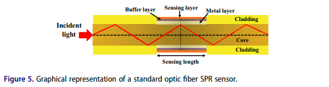

Sebelumnya, terdapat dua konfigurasi tradisional sensor SPR yaitu konfigurasi Otto dan Krestchman. konfigurasi tersebut didasarkan pada refleksi total. 

Kretschmann-based SPR pattern devices are extensively used because
of their outstanding success in sensing applications.

however, they encounter
several restrictions. These sensors are typically massive and manufactured
with movable components. Consequently, they are not portable.

Optical fiber-based SPRs are
deployed to successfully address those future challenges. The optical fibers are
lightweight and simple. Optical fiber-based SPRs are deployed to successfully address those future challenges. The optical fibers are lightweight and simple.

the sensor size which can potentially be used for remote sensing applications. The first optical fiber-based SPP arrangement without the bulk prism was suggested by Jorgenson et al. in 1993

karakteristik sensor plasmon sangat bergantung pada karakteristik transmisi atau refleksi sinar yang merambat. 

Kebanyakan, sensor SPR fiber optics-based menggunakan refleksi probe untuk merefleksikan kembali sinar yang merambat melalui fiber optik. 

Optical fiber SPR sensors have a small footprint, economical, and deliver
label-free detection. Moreover, they offer thin resonance peaks with high
responsivity and stability.

Merubah performa sensor dapat dilakukan dengan menyesuaikan lubang geometri pada mikrostruktur fiber optik.

Permukaan fiber optik umumnya dilapisi dengan layer tipis logam Au atau Ag. 

The sensing efficiency of optical fiber
relies on light wavelength, fiber geometry, and metal layer properties.

*sensing layer adalah tempat analit, dimana akan mempengaruhi serapan spektroskopi*

setelah itu dikembangkan fiber kristal fotonik yang diusulkan pada tahun 1978. fiber disusun menggunkaan dengan Fiber Bragg Grating. Fiber Bragg Grating (FBG) adalah struktur periodik dalam inti serat optik. berupa variasi indeks bias berulang pada rentang tertentu. ketika sinar merambat melelui FGB, panjang gelombang sinar yang sesuai dengan periode grating akan dipantulkan, sementara panjang gelombang lainya dapat diteruskan (gelombang bragg). FBG dapat digunakan untuk deteksi perubahan suhu, tekanan, dan regangan oleh karena akan mengubah periode grating. 

PCF SPR sensors have a small footprint and can be integrated into microscales. Due to the design freedom, PCFs geometry can be enhanced to achieve
the finest evanescent field

Fenomena plasmon berbasis fiber optik diamati dapat terjadi juga ketika mengganti layer logam dengan layer graphene, dimana layer tersebut dibuat melalui deposisi asap termal kimia. Hal ini meningkatkan efisiensi sensing diatas Au dan Ag. 

2006, SPR berbasis microstructured optical fiber (MOF) dikenalkan. Strukturnya, terdapat dua lubang, lubang pertama untuk distribusi udara sehingga mengurangi indeks bias untuk membantu pencocokan fase antara sinar dan plasmon yang penting untuk efisiensi eksitasi plason, lubang kedua untuk tempat analit. Lubang-lubang dalam struktur serat ini membantu dalam mencocokkan fase cahaya yang dipandu oleh serat dengan osilasi elektron (plasmons) di permukaan logam, sehingga memungkinkan deteksi SPR yang sensitif.

Plasmonics: A Necessity in the Field of Sensing-A Review
