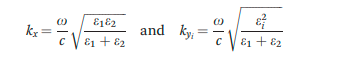

Terdapat beberapa pendekatan yang memberikan hubungan dispersi untuk plasmon permukaan. Hubungan antara frekuensi angular (ω) dan vektor gelombang (k). 

> frekuensi angular (ω) adalah skalar yang mengukur laju sudut (sudut persatuan waktu) atau laju perubahan temporal dari sinuoidal atau sinus

sedangkan komponen dari vektor gelombang dapat dituliskan sebagai berikut

dengan Ky merupakan bilangan imajiner dan Kx merupakan bilangan real. ε1 merupakan permitivitas logam, dan ε2 merupakan permitivitas dielektrik. Ketika gelombang elektromagnetik merambat sepanjang antarmuka maka akan terdapat evanescent yang menembus kedua media, baik material logam maupun dielektrik. Daya tembus (penetrasi) dari evanescent akan berbeda tergantung media yang dipenetrasi. 

Dalam kasus ini, misalnya pada interface logam dan air dengan karakteristik
- sinar : 700 nm
- frekuensi angular : 2.69x10^15 s^-1
- permitivitas lingkungan logam : -16
- permitivitas lingkungan dielektrik : 1.77

mennggunakan persamaan dasar fresnel, maka penetrasi evanescent untuk air adalah 238nm dan untuk logam adalah 26nm

misalnya

molekul X akan diperbolehkan ikut menyerap pada antarmuka logam-dielektrik. karena secara umum, permitivitas dielektrik akan berbeda beda setiap molekul, maka dengan adanya penambahan molekul X pada dielektrik (ε1), rata-rata konstanta permitivitas pada dielektrik akan berubah yang selanjutnya akan mengubah komponen vektor gelombang (Kx)

Ref [*](file:///D:/dokumen/Academic/Sarjana/Skripsi/skripsi.v2/referensi/plasmonic/cited/Handbook%20of%20Surface%20Plasmon%20Resonance_2017.pdf)