**Kalau ga pakai Reference Manager maka Nilai tidak keluar**

Referensi yang tidak ada tapi dimasukkan, itu akan langsung tidak lolos administrasi
mengubah skripsi menjadi artikel ilmiah

1.  Reference Manager : Mendeley

turnitin bisa mengecek berbagai bahasa, seperti ditransled dengan google. Reference manager dapat mengubah style reference sekaligus. UNY menggunakan APA 7. 

Referensi harus dituliskan judulnya. jika mengutip buku, harus dituliskan halamanya (saat akhir kutip) dan ditulis miring judulnya
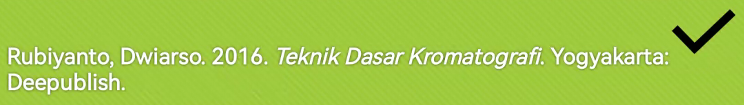

bahasa asing ditulis miring.  
kalimatnya panjang itu tidak boleh, ada kalimat utama, kalimat pendukung seperti itu. ada titiknya. minimal ada subject dan predikat. bahasa yang baku pointya bisa 10 persen. nama nama dalam referensi maksimal 5 dan selebihnya dituliskan et., al.

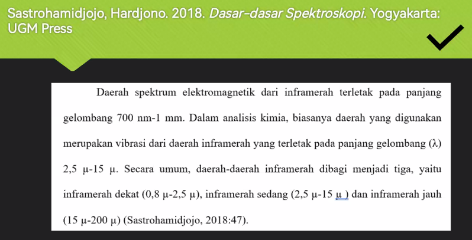
ini seharunya hanya Satromidjojo, H. 2018 ...
menurut aturan UNY (APA) harus nama belakang dan nama depan dengan singkatan. Journalnya kalau mau didingkat harus sudah disesuaikan. 

tidak boleh sumber sekunder ( mengambil sumber dari kutipan sumber). 

mengakses eduroam dari UGM bisa. 

maksimal kemiripan adalah 15%. tidak termasuk daftar pustaka dan judul. 

### Hakikat penulisan
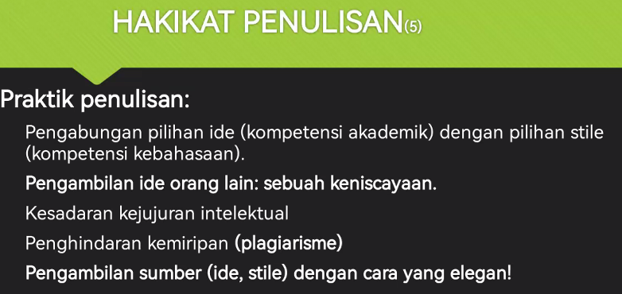

style orang memiliki berbeda-beda. tiap orang memiliki gaya untuk mengungkapkan. misalnya 'daripada' dan lain-lain.

praktik penulisan 
1. menulis mestri merujuk sumber lain baik berupa ide maupun gagasan
2. cara merujuk yang paling elegean adalah dengan cara memarafrasekan.
3. kemiripan bahasa denfan sumber rujukan dapat diminimalisir. 

dengan menyisipkan huruf a, bisa merubah persen turnitin secara signifikan. 

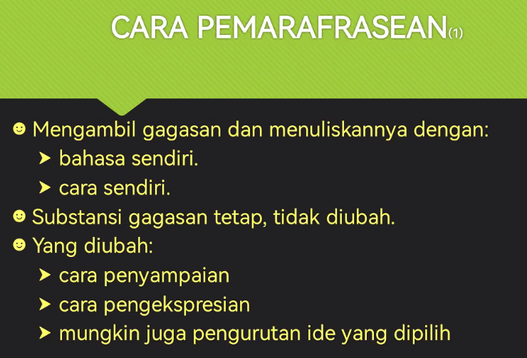

tidak boleh mengubah isi itu yang susah. dari pasif diubah menjadi aktif itu boleh. contoh

dari ini
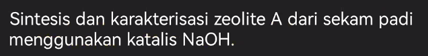

menjadi ini
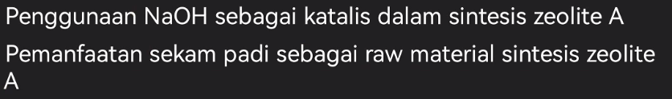

atau ini

cara parafrasa

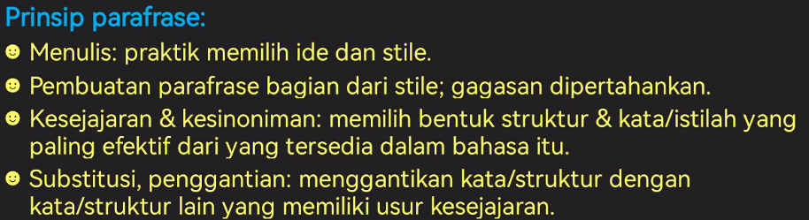

meskipun benar-benar sejajar itu susah, maka bisa sedikit dimaklumi walaupun sedikit berbeda.

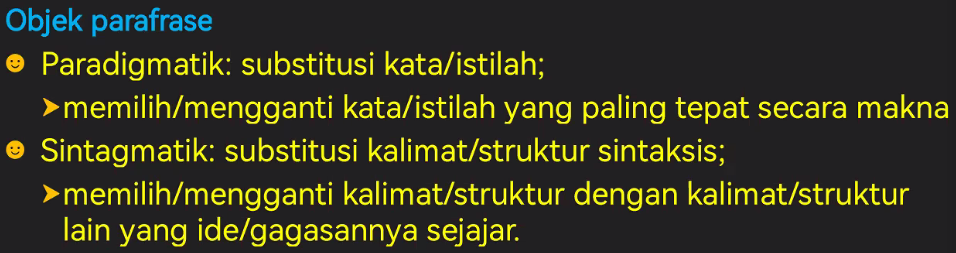

substitusi kata, atau substitusi kalimat. misalnya mengubah kalimat pasif menjadi kalimat aktif, itu termasuk dalam object sintagmatik. bu irin lebih suka memilih sintagmatik. 
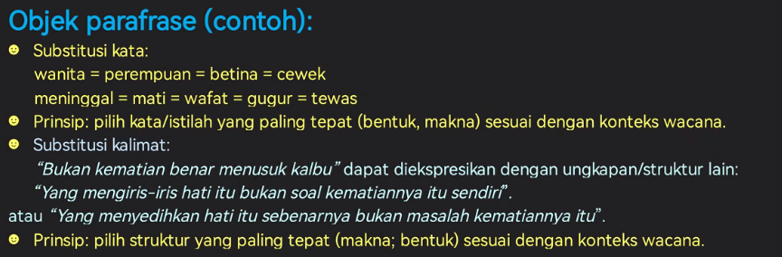

karya ilmiah lazimnya kalimat pasif. 

'according to' ganti dengan 'seperti yang telah dilaporkan'.

misalnya
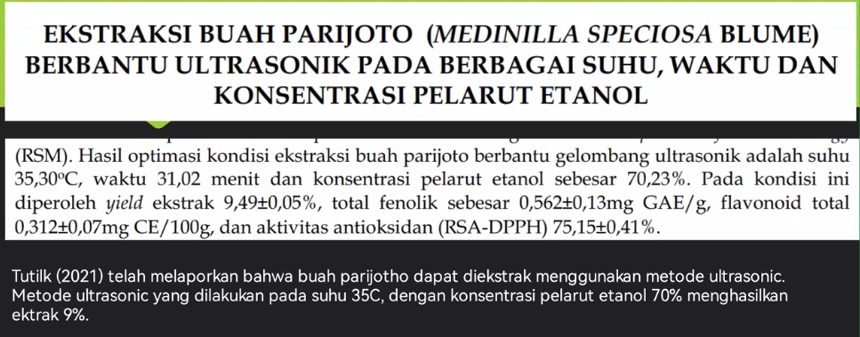

'telah' sebaiknya dihapus saja. 

jangan biasanya nonton punya temenya, walapun rumput tetangga selalu terlihat lebih hijau. 

1 data tidak boleh dipakai 2 orang, bolehnya dirujuk. kita bisanya mensitasi yaitu untuk menghormati karena ia telah meneliti duluan

bu irin adalah review journal. 

menurunkan journal jika ketahuan. bisa diprotes. disampaikan ke penulisnya. dibuat pengumuman di paltform, dan dibuat pernyataan dari penulis asli. dan di google masih ada. walapun bertahun-tahun. 

### Kerangka berpikir
tidak boleh ada referensi yang dirujuk, karena itu adalah pemikiran kita. 
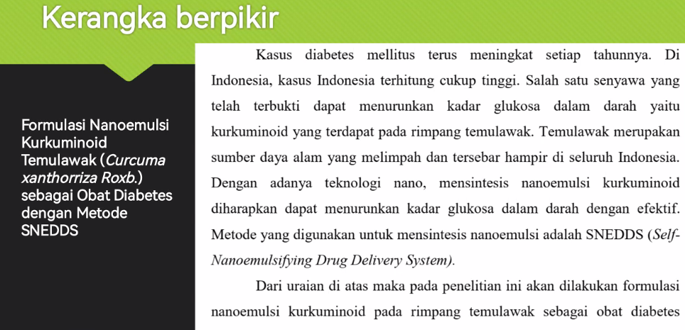

dan kerangka berpikir itu didukung oleh latar belakang. menggabungkan ide-ide kita ada di kerangka berpikir. sebenarnya ini adalah hasil penelitian orang lain, tetapi akan digabungkan disini, jadi jalan pikir kita akan terlihat disini. 

self plagiarism.

software gratis
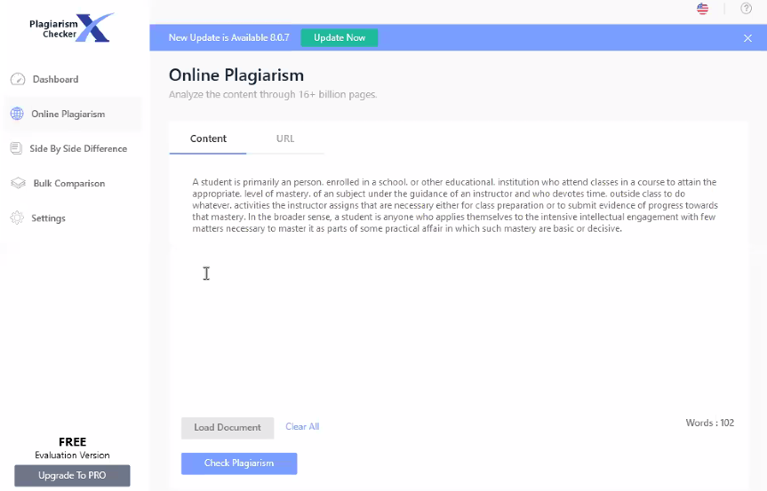

bisa menggunakan ini dulu, yaitu perparagraf-perparagraf. 