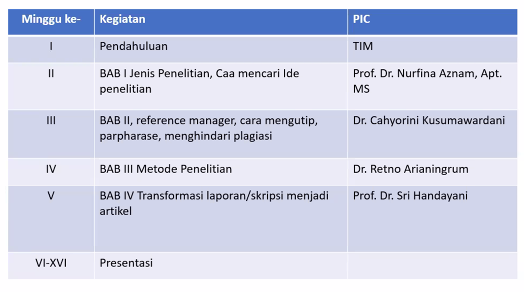
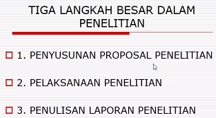
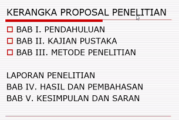
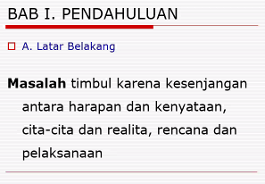
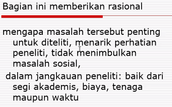
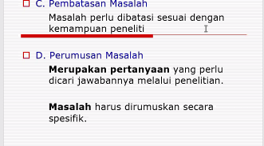
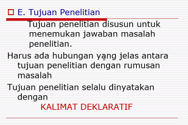
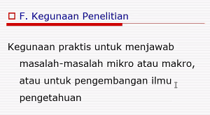

1.  wajib menggunakan mendeley
2.  mengumpulkan di minggu ke empat

Penyusunan proposal penelitian
pastikan ada masalah

selama 16 minggu kamu menyusun proposal penelitian.

diatas adalah target metopen
bab 1, 2, dan 3

dibawah ini adalah yang akan dibahas di senin besok itu.

tidak perlu semua diteliti yang esensial saja

penelitian tidak boleh terlalu luas, terlalu banyak, atau sudah diteliti banyak orang. perumusan masalah selalu dinyatakan dengan kalimat tanya.

dst ... habis itu bahas bab II

mintalah ppt nya ke bu nurfina
membuat kerangka proposal di kumpulkan hari minggu tanggal 10
minggu keempat mengumpulkan proposalnya