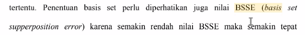
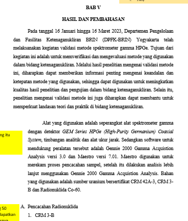

Identifikasi masalah adalah kalimat, harus ada masalah di setiap pointnya

BHA dan BHT bersifat karsinogenik, "sehingga dibutuhkan antioksidan bahan alami" -> yang ada di kutip adalah seharusnya ada di pembatasan masalah

setiap nomor dibatasi dengan nomor yang sama. misalnya nomor 1 identifikasi masalah, maka pembatasan masalah juga ditunjukkan untuk nomor 1

> blok kuning : untuk yang mau dikoreksi
> blok hijau : untuk yang sudah direvisi

kalau kebanyakan warna kuning, maka nilainya bagus. 
jika anda kesulitan mengidentifikasi masalah, anda dapat cek di latar belakang. 		

ketika mem buat batasan masalah, itu pasti ada kaitanya dengan metode. 

tujuan => tidak menentukan tetapi mempelajari. 

> Tinjauan Pustaka hanya menyebutkan sub bab yang akan dibahas. 

File kalau di classroom dan di tampilkan berbeda, maka di blok warna. 

**BISA UPLOAD LAGI PROPOSAL YANG MAU DIPRESENTASI (paling tidak sehari sebelum presentasi), TETAPI PROPOSAL KEMARIN TIDAK PELRLU DIHAPUS**

et al. ditulis miring

Pastikan pendahuluan tidak diulang di tinjauan pustaka. 
ketika membuat rumusan masalah, anda sudah mengira-ngira jawabanya apa
variabel kontrol, dalam komputasi itu aturanya ada, misalnya suhu dll

> Pastikan penulisan pembahasan hasil penelitian merupakan keselarasan dengan sistematika, kerangka berpikir, dan pertanyaan penelitian. Pastikan hasil penelitian telah menjawab seluruh pertanyaan penelitian. Pastikan penelitian telah sesuai dengan tujuan penelitian yang ditetapkan. Pastikan kesimpulan telah menjawab manfaat/kegunaan penelitian

seharusnya kepanjanganya dulu, baru singkatnya dikurung 

KERANGKA BERPIKIR
disebutkan permasalahan, kajian teori, berdasarkan kajian teori permasalah tersebut dapat diselesaikan dengan saran yang anda usulkan. itu bukan berisi prosedur, atau latar belakang. 

A harus ada diawal, A itu bold tidak seperti dibawah ini

gambar bold (tapi penjelasnya tidak di bold

tabel diatas tabel. kalau gambar itu dibawah gambar dan bold. judul kolom di bold. 

kalau laporan, antara A, 1, a), 1) itu bisa agak menjorok, tetapi untuk skripsi antara A, 1, a), 1) itu bisa sejajar agar tidak menghabiskan kertas. 
